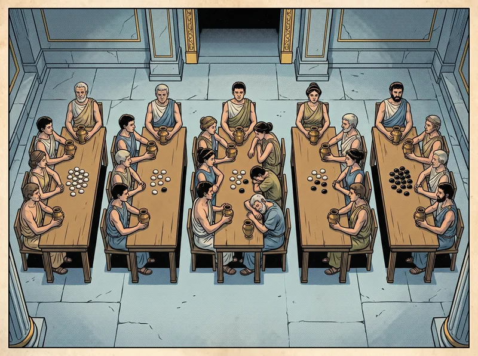

# Illustration Prompts — Volumes I–IV and VI–IX

This file is the work order for generating the comic panels of the eight chronicle pages
(`volume-1.html` … `volume-9.html`, excluding the already-illustrated `volume-5.html`).
Every page currently shows a dashed **“Illustration pending”** box wherever a panel belongs. Each box has
an ID (e.g. `v3-04`) that matches exactly one entry below.

> **Edit the pages directly.** The `volume-N.html` files are the source of truth. They were produced once
> by a throwaway build step that no longer exists; there is nothing to regenerate them from, so change the
> HTML in place.

- **Panels to generate:** 64
- **Covers:** already exist (`images/cover_volume_N.png` / `_small.webp`) — do not regenerate.
- **Inline diagrams:** `#fig-chart` (Vol I), `#fig-diamond` (Vol III) and `#fig-scrolls` (Vol IX) are hand-made
  SVGs, not placeholders. Leave them alone.

---

## 1. Workflow

1. **Generate** each panel as a PNG at `images/<file-stem>.png` using the prompt in its entry and the aspect
   ratio listed. The repo's existing generator can be reused:
   ```bash
   tools/gen.sh <file-stem> <aspect-ratio> "<prompt>"
   ```
   `tools/gen.sh` writes to this repo's `images/`. One caution: its built-in `STYLE` string hard-codes
   *“Setting: the ancient Greek island of Paxos”*. That is wrong for several volumes
   (Knossos, Byzantion, a Roman lock-house, a northern monastery). Each prompt below is **self-contained**
   (style + setting + scene), so prefer sending it without gen.sh's STYLE prefix, or make sure the prompt's
   own setting clearly overrides it. It needs `GEMINI_API_KEY` in the environment.
2. **Compress** to the web copy the pages actually load:
   ```bash
   python3 tools/compress.py <file-stem>      # writes images/<file-stem>_small.webp (max 800px wide)
   ```
3. **Replace the placeholder** in the volume page (see §2). Keep the `<figure>` and `<figcaption>` untouched.
4. **Verify**: open the page, check the image matches its caption, and run the check in §7.

Work volume by volume so each page's panels are stylistically consistent; generate a volume's first panel,
review it, then use it as a visual reference for the rest of that volume.

## 2. How to replace a placeholder

Each placeholder looks like this (example from `volume-3.html`):

```html
<figure class="panel mid tilt-r" id="fig-v3-04">
    <div class="frame">
      <!-- IMAGE PLACEHOLDER v3-04: replace this div with  — see IMAGE_PROMPTS.md -->
      <div class="img-placeholder" data-img-id="v3-04" data-img-file="images/vol3_pebble_chain_small.webp" role="img" aria-label="Illustration pending: …">
        <span class="ph-label">Illustration pending · v3-04</span>
        <span class="ph-desc">…</span>
      </div>
    </div>
    <figcaption>CHANGE ONE PEBBLE AT A TIME …</figcaption>
  </figure>
```

Replace the HTML comment **and** the whole `<div class="img-placeholder">…</div>` with a single image, using
the placeholder's description as the alt text:

```html
<figure class="panel mid tilt-r" id="fig-v3-04">
    <div class="frame"></div>
    <figcaption>CHANGE ONE PEBBLE AT A TIME …</figcaption>
  </figure>
```

This is the same markup `volume-5.html` uses for its panels. Do not change panel classes (`mid`, `narrow`,
`tilt-l`, `tilt-r`) or captions. The `.img-placeholder` CSS can stay in each page; it is harmless once unused.

## 3. Style bible (applies to every panel)

> Vintage 1970s comic book illustration style: bold black ink outlines, visible halftone dot shading, slightly aged newsprint paper texture, flat vibrant Mediterranean palette (aegean blue #136f9e, terracotta red #bf4a26, olive green #66722c, marble white, sand #f2e7cd, gold accents #c1912b, ink #1c1512). Dramatic, clean, readable comic-panel composition. Ancient/classical-era clothing and objects only. No speech balloons, captions, labels or legible writing anywhere in the image.

- **Match Volume V.** Look at `images/*_small.webp` from Volume V (e.g. `island`, `synod`, `president`,
  `conflict`) and the nine `cover_volume_N` images; new panels must look like they belong in the same book.
- **No lettering.** Captions are HTML on the page. Do not render words, numbers-as-text, signs, labels or
  speech balloons. Where a prompt needs a count or an order, it uses objects (tally marks, pebbles, knots,
  symbols). Small abstract glyphs on seals are fine.
- **No modern objects**, even in the volumes about modern systems. Computers are always clerks, keepers,
  monks or engineers; networks are roads and messengers; disks are strongrooms and tablets.
- **Humour is dry**, as in Lamport's original: characters are competent people in absurd circumstances,
  not cartoon buffoons. Traitors and faulty participants look ordinary.
- **Readable at 800px wide**: one clear focal action per panel; avoid tiny crowds of detail that turn to mush
  after compression.

## 4. Aspect ratios

| Panel class on the page | Aspect ratio to request | Displayed at |
|---|---|---|
| `panel` (no size class) | **16:9** | up to 840px wide |
| `panel mid` | **4:3** | up to 700px wide |
| `panel narrow` | **4:3** | up to 560px wide |

## 5. Casting and setting, by volume

### Volume I — The Disordered Sundials of the Aegean (`volume-1.html`)

**Setting.** A foggy Cycladic archipelago of small shepherd islands in the classical era: whitewashed
villages, terraced hillsides, goats and sheep, rowing skiffs, bronze sundials, abacuses, water-clocks
(clepsydrae). Morning fog and golden light.
**Recurring cast.** *Leslie*, the wandering scholar — draw him exactly as on the Volume I cover
(`images/cover_volume_1_small.webp`): a white-bearded elder in a green himation, with an abacus and a
satchel of scrolls. *Aristides* and
*Leonidas*, two quarrelsome shepherds (one stocky with a goat, one lanky with a branding iron). Later
glosses: two scribes, one sun-browned from a far southern island, one pale from a northern forest.
**Mood.** Wry, curious, scholarly; comic squabbles resolved by quiet cleverness.

### Volume II — The Generals Before the Walls (`volume-2.html`)

**Setting.** The siege of Byzantion (a Greek colony on a peninsula): a walled city by the sea, separate army
camps on surrounding hills, general's tents, horseback messengers, mountain passes and ravines, triremes.
**Recurring cast.** Hoplite generals in bronze crested helmets with differently coloured cloaks and banners
per camp; the traitor is visually ordinary (never a cartoon villain) — betrayal shown by shadow, coins or a
shifty glance. Three geometers may appear as older men with scrolls and compasses.
**Mood.** Tense military intrigue, torchlight and dusk; clarity of who holds which tablet matters more than
battle action. Orders are shown only as SYMBOLS (crossed swords = attack, retreating footprints = retreat).

### Volume III — The Curse of the Sleeping Shepherd (`volume-3.html`)

**Setting.** The sanctuary of Delphi on its mountainside; the oracle's cave; council chambers of island
delegates; the Fates at their loom; Aeolus, god of the winds, huge and cloud-bearded, holding tiny boats.
**Recurring cast.** Three austere priestesses in dark robes and veils. Delegates in plain chitons with
white and black pebbles and small bronze urns. The "sleeping shepherd" delegate slumped over his desk.
**Mood.** Mythic, ominous but with dry humour; cool blue-grey palette with gold highlights.

### Volume IV — The Passable Season (`volume-4.html`)

**Setting.** A navigators' guild of the Aegean: harbours, stone quays, sea charts, knotted sounding ropes,
astrolabes, hourglasses, drummers on headlands, stormy seas giving way to calm.
**Recurring cast.** Three weather-beaten navigators (one woman with braided hair and a sea chart, one older
man with a sounding rope, one with an astrolabe) — one of whom resembles a priestess from Volume III.
Captains at a ring of quays passing a lantern.
**Mood.** Salt, wind and practical hope; storms in slate grey turning to bright calm aegean blue.

### Volume VI — The Ledger of Many Decrees (`volume-6.html`)

**Setting.** The Minoan palace granary of Knossos, Crete: painted red columns, rows of huge pithoi storage
jars, clay Linear-B-style tablets (no legible script), cylinder seals, storehouses connected by muddy
roads, runners with baskets.
**Recurring cast.** *The mistress of the granary* — a composed, sharp-eyed senior clerk in a simple dark
robe with a cylinder seal on a cord; *her apprentice clerk* — young, with ink-stained fingers; in later
chapters a second apprentice. Stewards wear a bull's-head sigil pendant. (Characters are allegorical types,
not likenesses of the papers' authors.)
**Mood.** Dry, orderly, bureaucratic competence; warm terracotta and ochre palette.

### Volume VII — The Citadel of Iron Quorums (`volume-7.html`)

**Setting.** A newly built citadel on a harbour hill: iron-bound vaults, a treasure chest with four locks,
gateposts, a stone harbour wall carved with tide lines, a fortified library of scrolls.
**Recurring cast.** *Two inquisitors* — the mistress of the granary from Volume VI (same costume
language, now in a dark travelling cloak) and a younger, intense master builder carrying plans. Four keepers in
bronze-studded leather; the warden wears a heavy chain of office. Pirates as shadowy bribers.
**Mood.** Stone, iron and ledgers; fortress severity with a thread of accountant's humour.

### Volume VIII — The Quarries of the Roman Guilds (`volume-8.html`)

**Setting.** Roman-era Greece: imperial engineers in red tunics and military sandals, groma surveying
instruments, wax tablets, engineering workshops, a three-storey Roman lock-house, quarries, sea cliffs,
records offices lit by lamps.
**Recurring cast.** Three Roman engineers — a calm senior engineer, a pragmatic one with a measuring
rod, and a younger one with a wax tablet (allegorical types, not likenesses). Bored or
anxious operators in plain tunics.
**Mood.** Brisk, pragmatic, rueful — the comedy of real-world breakage; brick red, stone grey, lamp gold.

### Volume IX — The Reformation of the Raft Monks (`volume-9.html`)

**Setting.** A simple stone monastery on a misty northern coast among tall dark trees (contrast with the sunny
Aegean): bell tower, cloister, scriptorium, chapter house, refectory. Long parchment scrolls, reign-seals,
sand-glasses, voting pebbles and urns.
**Recurring cast.** *The two founding monks* — one young and earnest, one older and good-humoured (both
allegorical types, not likenesses); whoever is Abbot carries a simple wooden crozier; brothers wear plain
brown habits; novices lighter grey.
**Mood.** Calm, clear, legible — deliberately simpler compositions than the earlier volumes, cool greens
and greys with warm candlelight.

## 6. Panel entries

Each entry: the page, the section it illustrates, the files to produce, the aspect ratio, the caption printed under it (so the art can complement it rather than repeat or contradict it), and a self-contained prompt.


### Volume I — The Disordered Sundials of the Aegean

#### `v1-01` — vol1_archipelago

| | |
|---|---|
| Page | `volume-1.html` → `#fig-v1-01` (section “1.1 · The Archipelago”) |
| Files | `images/vol1_archipelago.png` → `images/vol1_archipelago_small.webp` |
| Aspect ratio | **16:9** (wide panel, max 840px; classes `tilt-l`) |
| Caption on page | THE ISLANDS OF THE ARCHIPELAGO SPOKE TO ONE ANOTHER ONLY BY SKIFF — AND NO TWO SUNDIALS AGREED. |

**Prompt**

```text
Vintage 1970s comic book illustration style: bold black ink outlines, visible halftone dot shading, slightly aged newsprint paper texture, flat vibrant Mediterranean palette (aegean blue #136f9e, terracotta red #bf4a26, olive green #66722c, marble white, sand #f2e7cd, gold accents #c1912b, ink #1c1512). Dramatic, clean, readable comic-panel composition. Ancient/classical-era clothing and objects only. No speech balloons, captions, labels or legible writing anywhere in the image. Setting: A foggy Cycladic archipelago of small shepherd islands in the classical era: whitewashed villages, terraced hillsides, goats and sheep, rowing skiffs, bronze sundials, abacuses, water-clocks (clepsydrae). Morning fog and golden light. Recurring characters (use only those present in the scene): Leslie, the wandering scholar — draw him exactly as on the Volume I cover (`images/cover_volume_1_small.webp`): a white-bearded elder in a green himation, with an abacus and a satchel of scrolls. Aristides and Leonidas, two quarrelsome shepherds (one stocky with a goat, one lanky with a branding iron). Later glosses: two scribes, one sun-browned from a far southern island, one pale from a northern forest. Mood: Wry, curious, scholarly; comic squabbles resolved by quiet cleverness. Scene: A foggy Aegean archipelago at dawn: several small islands, each with a shepherd village and a bronze sundial; the sundials cast shadows at visibly different angles, and small skiffs row between the islands.
```

#### `v1-02` — vol1_feud

| | |
|---|---|
| Page | `volume-1.html` → `#fig-v1-02` (section “1.2 · The Feud of Aristides and Leonidas”) |
| Files | `images/vol1_feud.png` → `images/vol1_feud_small.webp` |
| Aspect ratio | **4:3** (mid panel, max 700px; classes `mid tilt-r`) |
| Caption on page | “I SHEARED MY GOAT FIRST!” “YOU LIE — I BRANDED MY SHEEP BEFORE THE SHADOW MOVED!” ENTER THE WANDERING SCHOLAR. |

**Prompt**

```text
Vintage 1970s comic book illustration style: bold black ink outlines, visible halftone dot shading, slightly aged newsprint paper texture, flat vibrant Mediterranean palette (aegean blue #136f9e, terracotta red #bf4a26, olive green #66722c, marble white, sand #f2e7cd, gold accents #c1912b, ink #1c1512). Dramatic, clean, readable comic-panel composition. Ancient/classical-era clothing and objects only. No speech balloons, captions, labels or legible writing anywhere in the image. Setting: A foggy Cycladic archipelago of small shepherd islands in the classical era: whitewashed villages, terraced hillsides, goats and sheep, rowing skiffs, bronze sundials, abacuses, water-clocks (clepsydrae). Morning fog and golden light. Recurring characters (use only those present in the scene): Leslie, the wandering scholar — draw him exactly as on the Volume I cover (`images/cover_volume_1_small.webp`): a white-bearded elder in a green himation, with an abacus and a satchel of scrolls. Aristides and Leonidas, two quarrelsome shepherds (one stocky with a goat, one lanky with a branding iron). Later glosses: two scribes, one sun-browned from a far southern island, one pale from a northern forest. Mood: Wry, curious, scholarly; comic squabbles resolved by quiet cleverness. Scene: Two furious shepherds, Aristides with a shorn goat and Leonidas with a freshly branded sheep, shout at each other in a crowded agora while the wandering scholar Leslie — a white-bearded elder in a green himation with a satchel of scrolls — steps off a boat behind them.
```

#### `v1-03` — vol1_bead

| | |
|---|---|
| Page | `volume-1.html` → `#fig-v1-03` (section “The Law of the Monotonic Bead”) |
| Files | `images/vol1_bead.png` → `images/vol1_bead_small.webp` |
| Aspect ratio | **4:3** (narrow panel, max 560px; classes `narrow tilt-l`) |
| Caption on page | THE LAW OF THE MONOTONIC BEAD: FLICK A BEAD FOR EVERY DEED, AND PUSH PAST THE COUNT ON EVERY SLATE YOU RECEIVE. |

**Prompt**

```text
Vintage 1970s comic book illustration style: bold black ink outlines, visible halftone dot shading, slightly aged newsprint paper texture, flat vibrant Mediterranean palette (aegean blue #136f9e, terracotta red #bf4a26, olive green #66722c, marble white, sand #f2e7cd, gold accents #c1912b, ink #1c1512). Dramatic, clean, readable comic-panel composition. Ancient/classical-era clothing and objects only. No speech balloons, captions, labels or legible writing anywhere in the image. Setting: A foggy Cycladic archipelago of small shepherd islands in the classical era: whitewashed villages, terraced hillsides, goats and sheep, rowing skiffs, bronze sundials, abacuses, water-clocks (clepsydrae). Morning fog and golden light. Recurring characters (use only those present in the scene): Leslie, the wandering scholar — draw him exactly as on the Volume I cover (`images/cover_volume_1_small.webp`): a white-bearded elder in a green himation, with an abacus and a satchel of scrolls. Aristides and Leonidas, two quarrelsome shepherds (one stocky with a goat, one lanky with a branding iron). Later glosses: two scribes, one sun-browned from a far southern island, one pale from a northern forest. Mood: Wry, curious, scholarly; comic squabbles resolved by quiet cleverness. Scene: Close-up of a weathered shepherd at a harbour: in one hand an abacus, flicking a bead forward with his thumb; a messenger hands him a clay slate stamped with a number, and he is visibly pushing his beads past it.
```

#### `v1-04` — vol1_olive_press

| | |
|---|---|
| Page | `volume-1.html` → `#fig-v1-04` (section “4.2 · The Olive Press”) |
| Files | `images/vol1_olive_press.png` → `images/vol1_olive_press_small.webp` |
| Aspect ratio | **16:9** (wide panel, max 840px; classes `tilt-r`) |
| Caption on page | THE ARCHIPELAGO HAD ONE OLIVE PRESS. ONLY ONE ISLANDER COULD USE IT AT A TIME — AND NO ONE WAS IN CHARGE OF THE QUEUE. |

**Prompt**

```text
Vintage 1970s comic book illustration style: bold black ink outlines, visible halftone dot shading, slightly aged newsprint paper texture, flat vibrant Mediterranean palette (aegean blue #136f9e, terracotta red #bf4a26, olive green #66722c, marble white, sand #f2e7cd, gold accents #c1912b, ink #1c1512). Dramatic, clean, readable comic-panel composition. Ancient/classical-era clothing and objects only. No speech balloons, captions, labels or legible writing anywhere in the image. Setting: A foggy Cycladic archipelago of small shepherd islands in the classical era: whitewashed villages, terraced hillsides, goats and sheep, rowing skiffs, bronze sundials, abacuses, water-clocks (clepsydrae). Morning fog and golden light. Recurring characters (use only those present in the scene): Leslie, the wandering scholar — draw him exactly as on the Volume I cover (`images/cover_volume_1_small.webp`): a white-bearded elder in a green himation, with an abacus and a satchel of scrolls. Aristides and Leonidas, two quarrelsome shepherds (one stocky with a goat, one lanky with a branding iron). Later glosses: two scribes, one sun-browned from a far southern island, one pale from a northern forest. Mood: Wry, curious, scholarly; comic squabbles resolved by quiet cleverness. Scene: A great stone olive press on a hill overlooking several islands. One islander works the press while others wait with baskets of olives; each waiting islander holds a personal wax tablet listing a queue of names and numbers, and messengers row between the islands carrying slates.
```

#### `v1-05` — vol1_beacon

| | |
|---|---|
| Page | `volume-1.html` → `#fig-v1-05` (section “The Beacon Fires”) |
| Files | `images/vol1_beacon.png` → `images/vol1_beacon_small.webp` |
| Aspect ratio | **4:3** (mid panel, max 700px; classes `mid tilt-l`) |
| Caption on page | A BEACON FIRE CROSSES THE STRAIT FASTER THAN ANY SKIFF — AND THE BEADS KNOW NOTHING OF IT. |

**Prompt**

```text
Vintage 1970s comic book illustration style: bold black ink outlines, visible halftone dot shading, slightly aged newsprint paper texture, flat vibrant Mediterranean palette (aegean blue #136f9e, terracotta red #bf4a26, olive green #66722c, marble white, sand #f2e7cd, gold accents #c1912b, ink #1c1512). Dramatic, clean, readable comic-panel composition. Ancient/classical-era clothing and objects only. No speech balloons, captions, labels or legible writing anywhere in the image. Setting: A foggy Cycladic archipelago of small shepherd islands in the classical era: whitewashed villages, terraced hillsides, goats and sheep, rowing skiffs, bronze sundials, abacuses, water-clocks (clepsydrae). Morning fog and golden light. Recurring characters (use only those present in the scene): Leslie, the wandering scholar — draw him exactly as on the Volume I cover (`images/cover_volume_1_small.webp`): a white-bearded elder in a green himation, with an abacus and a satchel of scrolls. Aristides and Leonidas, two quarrelsome shepherds (one stocky with a goat, one lanky with a branding iron). Later glosses: two scribes, one sun-browned from a far southern island, one pale from a northern forest. Mood: Wry, curious, scholarly; comic squabbles resolved by quiet cleverness. Scene: Night scene across a narrow strait: on one island a shepherd has just handed a request slate to a slow rowing skiff and is now lighting a tall beacon fire; on the far island his friend sees the flames and hurries to hand his own slate to a different skiff, which is already pulling ahead of the first.
```

#### `v1-06` — vol1_clepsydra

| | |
|---|---|
| Page | `volume-1.html` → `#fig-v1-06` (section “The Water-Clocks”) |
| Files | `images/vol1_clepsydra.png` → `images/vol1_clepsydra_small.webp` |
| Aspect ratio | **16:9** (wide panel, max 840px; classes `tilt-r`) |
| Caption on page | THE WATER-CLOCK REFORM: A CLOCK MAY BE PUSHED FORWARD WHEN A SLATE ARRIVES — NEVER BACK. |

**Prompt**

```text
Vintage 1970s comic book illustration style: bold black ink outlines, visible halftone dot shading, slightly aged newsprint paper texture, flat vibrant Mediterranean palette (aegean blue #136f9e, terracotta red #bf4a26, olive green #66722c, marble white, sand #f2e7cd, gold accents #c1912b, ink #1c1512). Dramatic, clean, readable comic-panel composition. Ancient/classical-era clothing and objects only. No speech balloons, captions, labels or legible writing anywhere in the image. Setting: A foggy Cycladic archipelago of small shepherd islands in the classical era: whitewashed villages, terraced hillsides, goats and sheep, rowing skiffs, bronze sundials, abacuses, water-clocks (clepsydrae). Morning fog and golden light. Recurring characters (use only those present in the scene): Leslie, the wandering scholar — draw him exactly as on the Volume I cover (`images/cover_volume_1_small.webp`): a white-bearded elder in a green himation, with an abacus and a satchel of scrolls. Aristides and Leonidas, two quarrelsome shepherds (one stocky with a goat, one lanky with a branding iron). Later glosses: two scribes, one sun-browned from a far southern island, one pale from a northern forest. Mood: Wry, curious, scholarly; comic squabbles resolved by quiet cleverness. Scene: A harbour office with a row of bronze water-clocks (clepsydrae) on a shelf, each dripping at a slightly different rate; a clerk reads a stamped slate just off a skiff and nudges one clock's float FORWARD with a rod, while a painted sign with a crossed-out backward arrow hangs on the wall.
```

#### `v1-07` — vol1_vector_abacus

| | |
|---|---|
| Page | `volume-1.html` → `#fig-v1-07` (section “7.1 · One Row of Beads per Island”) |
| Files | `images/vol1_vector_abacus.png` → `images/vol1_vector_abacus_small.webp` |
| Aspect ratio | **4:3** (narrow panel, max 560px; classes `narrow tilt-r`) |
| Caption on page | THE LATER HAND: CARRY ONE ROW OF BEADS PER ISLAND, NOT ONE IN TOTAL — AND CONCURRENCY BECOMES VISIBLE. |

**Prompt**

```text
Vintage 1970s comic book illustration style: bold black ink outlines, visible halftone dot shading, slightly aged newsprint paper texture, flat vibrant Mediterranean palette (aegean blue #136f9e, terracotta red #bf4a26, olive green #66722c, marble white, sand #f2e7cd, gold accents #c1912b, ink #1c1512). Dramatic, clean, readable comic-panel composition. Ancient/classical-era clothing and objects only. No speech balloons, captions, labels or legible writing anywhere in the image. Setting: A foggy Cycladic archipelago of small shepherd islands in the classical era: whitewashed villages, terraced hillsides, goats and sheep, rowing skiffs, bronze sundials, abacuses, water-clocks (clepsydrae). Morning fog and golden light. Recurring characters (use only those present in the scene): Leslie, the wandering scholar — draw him exactly as on the Volume I cover (`images/cover_volume_1_small.webp`): a white-bearded elder in a green himation, with an abacus and a satchel of scrolls. Aristides and Leonidas, two quarrelsome shepherds (one stocky with a goat, one lanky with a branding iron). Later glosses: two scribes, one sun-browned from a far southern island, one pale from a northern forest. Mood: Wry, curious, scholarly; comic squabbles resolved by quiet cleverness. Scene: A scribe at a lamp-lit desk with an enormous abacus that has one row of beads for each island, each row labeled with a small painted island emblem (goat, olive, fish); he is copying the maximum of each row from a received slate onto his own abacus.
```

#### `v1-08` — vol1_census

| | |
|---|---|
| Page | `volume-1.html` → `#fig-v1-08` (section “7.2 · The Census and the Colour of Seals”) |
| Files | `images/vol1_census.png` → `images/vol1_census_small.webp` |
| Aspect ratio | **16:9** (wide panel, max 840px; classes `tilt-l`) |
| Caption on page | THE NORTHERN SCRIBE’S CENSUS: WHITE SEALS BEFORE, RED SEALS AFTER. THE FIRST RED SLATE AN ISLANDER SEES, HE COUNTS HIS FLOCK. |

**Prompt**

```text
Vintage 1970s comic book illustration style: bold black ink outlines, visible halftone dot shading, slightly aged newsprint paper texture, flat vibrant Mediterranean palette (aegean blue #136f9e, terracotta red #bf4a26, olive green #66722c, marble white, sand #f2e7cd, gold accents #c1912b, ink #1c1512). Dramatic, clean, readable comic-panel composition. Ancient/classical-era clothing and objects only. No speech balloons, captions, labels or legible writing anywhere in the image. Setting: A foggy Cycladic archipelago of small shepherd islands in the classical era: whitewashed villages, terraced hillsides, goats and sheep, rowing skiffs, bronze sundials, abacuses, water-clocks (clepsydrae). Morning fog and golden light. Recurring characters (use only those present in the scene): Leslie, the wandering scholar — draw him exactly as on the Volume I cover (`images/cover_volume_1_small.webp`): a white-bearded elder in a green himation, with an abacus and a satchel of scrolls. Aristides and Leonidas, two quarrelsome shepherds (one stocky with a goat, one lanky with a branding iron). Later glosses: two scribes, one sun-browned from a far southern island, one pale from a northern forest. Mood: Wry, curious, scholarly; comic squabbles resolved by quiet cleverness. Scene: A census of the archipelago: on several islands at once, clerks count families and livestock; messengers in skiffs carry slates sealed with either white wax or red wax; one clerk receiving a red-sealed slate is dramatically switching his own seal-stamp from white to red while the census tally on his island begins.
```


### Volume II — The Generals Before the Walls

#### `v2-01` — vol2_siege

| | |
|---|---|
| Page | `volume-2.html` → `#fig-v2-01` (section “The Siege of Byzantion”) |
| Files | `images/vol2_siege.png` → `images/vol2_siege_small.webp` |
| Aspect ratio | **16:9** (wide panel, max 840px; classes `tilt-l`) |
| Caption on page | THE DIVISIONS WERE CAMPED ALL AROUND THE CITY. THE GENERALS COULD SPEAK TO ONE ANOTHER ONLY BY MESSENGER. |

**Prompt**

```text
Vintage 1970s comic book illustration style: bold black ink outlines, visible halftone dot shading, slightly aged newsprint paper texture, flat vibrant Mediterranean palette (aegean blue #136f9e, terracotta red #bf4a26, olive green #66722c, marble white, sand #f2e7cd, gold accents #c1912b, ink #1c1512). Dramatic, clean, readable comic-panel composition. Ancient/classical-era clothing and objects only. No speech balloons, captions, labels or legible writing anywhere in the image. Setting: The siege of Byzantion (a Greek colony on a peninsula): a walled city by the sea, separate army camps on surrounding hills, general's tents, horseback messengers, mountain passes and ravines, triremes. Recurring characters (use only those present in the scene): Hoplite generals in bronze crested helmets with differently coloured cloaks and banners per camp; the traitor is visually ordinary (never a cartoon villain) — betrayal shown by shadow, coins or a shifty glance. Three geometers may appear as older men with scrolls and compasses. Mood: Tense military intrigue, torchlight and dusk; clarity of who holds which tablet matters more than battle action. Orders are shown only as SYMBOLS (crossed swords = attack, retreating footprints = retreat). Scene: A walled city on a peninsula at dusk, encircled at a distance by the separate camps of a Greek army; each camp has its own general's tent flying a different banner, and lone horseback messengers ride the long roads between the camps.
```

#### `v2-02` — vol2_traitor

| | |
|---|---|
| Page | `volume-2.html` → `#fig-v2-02` (section “1.2 · The Commander and His Lieutenants”) |
| Files | `images/vol2_traitor.png` → `images/vol2_traitor_small.webp` |
| Aspect ratio | **4:3** (mid panel, max 700px; classes `mid tilt-r`) |
| Caption on page | THE BRIBED GENERAL NEED NOT REFUSE TO FIGHT. HE NEED ONLY TELL THE LEFT FLANK ONE THING AND THE RIGHT FLANK ANOTHER. |

**Prompt**

```text
Vintage 1970s comic book illustration style: bold black ink outlines, visible halftone dot shading, slightly aged newsprint paper texture, flat vibrant Mediterranean palette (aegean blue #136f9e, terracotta red #bf4a26, olive green #66722c, marble white, sand #f2e7cd, gold accents #c1912b, ink #1c1512). Dramatic, clean, readable comic-panel composition. Ancient/classical-era clothing and objects only. No speech balloons, captions, labels or legible writing anywhere in the image. Setting: The siege of Byzantion (a Greek colony on a peninsula): a walled city by the sea, separate army camps on surrounding hills, general's tents, horseback messengers, mountain passes and ravines, triremes. Recurring characters (use only those present in the scene): Hoplite generals in bronze crested helmets with differently coloured cloaks and banners per camp; the traitor is visually ordinary (never a cartoon villain) — betrayal shown by shadow, coins or a shifty glance. Three geometers may appear as older men with scrolls and compasses. Mood: Tense military intrigue, torchlight and dusk; clarity of who holds which tablet matters more than battle action. Orders are shown only as SYMBOLS (crossed swords = attack, retreating footprints = retreat). Scene: Inside a lamp-lit general's tent at night, a cloaked figure from the besieged city hands a purse of gold coins to a general, who is already dictating to two different scribes at once: one scribe draws a crossed-swords symbol (attack) on a tablet, the other draws a retreating-footprints symbol.
```

#### `v2-03` — vol2_three_generals

| | |
|---|---|
| Page | `volume-2.html` → `#fig-v2-03` (section “2.1 · Three Generals, One Traitor”) |
| Files | `images/vol2_three_generals.png` → `images/vol2_three_generals_small.webp` |
| Aspect ratio | **16:9** (wide panel, max 840px; classes `tilt-l`) |
| Caption on page | TWO DIFFERENT BETRAYALS — AND FROM WHERE LIEUTENANT 1 STANDS, THEY LOOK EXACTLY ALIKE. |

**Prompt**

```text
Vintage 1970s comic book illustration style: bold black ink outlines, visible halftone dot shading, slightly aged newsprint paper texture, flat vibrant Mediterranean palette (aegean blue #136f9e, terracotta red #bf4a26, olive green #66722c, marble white, sand #f2e7cd, gold accents #c1912b, ink #1c1512). Dramatic, clean, readable comic-panel composition. Ancient/classical-era clothing and objects only. No speech balloons, captions, labels or legible writing anywhere in the image. Setting: The siege of Byzantion (a Greek colony on a peninsula): a walled city by the sea, separate army camps on surrounding hills, general's tents, horseback messengers, mountain passes and ravines, triremes. Recurring characters (use only those present in the scene): Hoplite generals in bronze crested helmets with differently coloured cloaks and banners per camp; the traitor is visually ordinary (never a cartoon villain) — betrayal shown by shadow, coins or a shifty glance. Three geometers may appear as older men with scrolls and compasses. Mood: Tense military intrigue, torchlight and dusk; clarity of who holds which tablet matters more than battle action. Orders are shown only as SYMBOLS (crossed swords = attack, retreating footprints = retreat). Scene: A split comic panel with a vertical divider. Left half: a loyal commander on a white horse gives a crossed-swords tablet to Lieutenant 1 and the same to Lieutenant 2, but Lieutenant 2 (shifty, shadowed face) whispers a retreating-footprints tablet to Lieutenant 1. Right half: a shifty commander hands a crossed-swords tablet to Lieutenant 1 and a retreating-footprints tablet to an honest-faced Lieutenant 2, who passes it on to Lieutenant 1. Lieutenant 1's pose and the tablets he holds are IDENTICAL in both halves.
```

#### `v2-04` — vol2_illyrian

| | |
|---|---|
| Page | `volume-2.html` → `#fig-v2-04` (section “2.2 · The Illyrian Generals”) |
| Files | `images/vol2_illyrian.png` → `images/vol2_illyrian_small.webp` |
| Aspect ratio | **4:3** (narrow panel, max 560px; classes `narrow tilt-r`) |
| Caption on page | EACH OF THREE GENERALS PLAYS THE PART OF A THIRD OF THE ILLYRIAN ARMY. |

**Prompt**

```text
Vintage 1970s comic book illustration style: bold black ink outlines, visible halftone dot shading, slightly aged newsprint paper texture, flat vibrant Mediterranean palette (aegean blue #136f9e, terracotta red #bf4a26, olive green #66722c, marble white, sand #f2e7cd, gold accents #c1912b, ink #1c1512). Dramatic, clean, readable comic-panel composition. Ancient/classical-era clothing and objects only. No speech balloons, captions, labels or legible writing anywhere in the image. Setting: The siege of Byzantion (a Greek colony on a peninsula): a walled city by the sea, separate army camps on surrounding hills, general's tents, horseback messengers, mountain passes and ravines, triremes. Recurring characters (use only those present in the scene): Hoplite generals in bronze crested helmets with differently coloured cloaks and banners per camp; the traitor is visually ordinary (never a cartoon villain) — betrayal shown by shadow, coins or a shifty glance. Three geometers may appear as older men with scrolls and compasses. Mood: Tense military intrigue, torchlight and dusk; clarity of who holds which tablet matters more than battle action. Orders are shown only as SYMBOLS (crossed swords = attack, retreating footprints = retreat). Scene: A single Greek general in his tent bends over a large campaign map covered with many small painted wooden figurines of foreign (Illyrian) generals in distinctive tall helmets; he moves a whole cluster of figurines at once with both hands, like a puppeteer.
```

#### `v2-05` — vol2_oral_relay

| | |
|---|---|
| Page | `volume-2.html` → `#fig-v2-05` (section “The Spoken Order”) |
| Files | `images/vol2_oral_relay.png` → `images/vol2_oral_relay_small.webp` |
| Aspect ratio | **4:3** (mid panel, max 700px; classes `mid tilt-l`) |
| Caption on page | FOUR GENERALS, ONE TRAITOR: LIEUTENANT 2 HEARS “ATTACK”, “ATTACK”, AND ONE LIE — AND TAKES THE MAJORITY. |

**Prompt**

```text
Vintage 1970s comic book illustration style: bold black ink outlines, visible halftone dot shading, slightly aged newsprint paper texture, flat vibrant Mediterranean palette (aegean blue #136f9e, terracotta red #bf4a26, olive green #66722c, marble white, sand #f2e7cd, gold accents #c1912b, ink #1c1512). Dramatic, clean, readable comic-panel composition. Ancient/classical-era clothing and objects only. No speech balloons, captions, labels or legible writing anywhere in the image. Setting: The siege of Byzantion (a Greek colony on a peninsula): a walled city by the sea, separate army camps on surrounding hills, general's tents, horseback messengers, mountain passes and ravines, triremes. Recurring characters (use only those present in the scene): Hoplite generals in bronze crested helmets with differently coloured cloaks and banners per camp; the traitor is visually ordinary (never a cartoon villain) — betrayal shown by shadow, coins or a shifty glance. Three geometers may appear as older men with scrolls and compasses. Mood: Tense military intrigue, torchlight and dusk; clarity of who holds which tablet matters more than battle action. Orders are shown only as SYMBOLS (crossed swords = attack, retreating footprints = retreat). Scene: Four hilltop camps around a campfire-lit valley: a commander on the highest hill sends three messengers down to three lieutenants' camps; the lieutenants then send messengers across to each other. In the foreground, Lieutenant 2 sits at a camp table sorting three wax tablets into a pile of two matching ones and one odd one out.
```

#### `v2-06` — vol2_two_seals

| | |
|---|---|
| Page | `volume-2.html` → `#fig-v2-06` (section “The Sealed Order”) |
| Files | `images/vol2_two_seals.png` → `images/vol2_two_seals_small.webp` |
| Aspect ratio | **4:3** (mid panel, max 700px; classes `mid tilt-r`) |
| Caption on page | THE SAME SEAL ON TWO DIFFERENT ORDERS. ONLY THE COMMANDER COULD HAVE MADE BOTH — SO THE COMMANDER IS THE TRAITOR. |

**Prompt**

```text
Vintage 1970s comic book illustration style: bold black ink outlines, visible halftone dot shading, slightly aged newsprint paper texture, flat vibrant Mediterranean palette (aegean blue #136f9e, terracotta red #bf4a26, olive green #66722c, marble white, sand #f2e7cd, gold accents #c1912b, ink #1c1512). Dramatic, clean, readable comic-panel composition. Ancient/classical-era clothing and objects only. No speech balloons, captions, labels or legible writing anywhere in the image. Setting: The siege of Byzantion (a Greek colony on a peninsula): a walled city by the sea, separate army camps on surrounding hills, general's tents, horseback messengers, mountain passes and ravines, triremes. Recurring characters (use only those present in the scene): Hoplite generals in bronze crested helmets with differently coloured cloaks and banners per camp; the traitor is visually ordinary (never a cartoon villain) — betrayal shown by shadow, coins or a shifty glance. Three geometers may appear as older men with scrolls and compasses. Mood: Tense military intrigue, torchlight and dusk; clarity of who holds which tablet matters more than battle action. Orders are shown only as SYMBOLS (crossed swords = attack, retreating footprints = retreat). Scene: Close-up of a lieutenant in a bronze helmet holding up two wax tablets side by side in the torchlight: one shows a crossed-swords symbol, the other a retreating-footprints symbol, and both bear the SAME large red wax seal with the commander's eagle emblem. His eyes are wide with realization.
```

#### `v2-07` — vol2_broken_roads

| | |
|---|---|
| Page | `volume-2.html` → `#fig-v2-07` (section “The Broken Roads”) |
| Files | `images/vol2_broken_roads.png` → `images/vol2_broken_roads_small.webp` |
| Aspect ratio | **16:9** (wide panel, max 840px; classes `tilt-l`) |
| Caption on page | NOT EVERY CAMP COULD REACH EVERY OTHER. SOME ORDERS HAD TO PASS THROUGH OTHER GENERALS’ HANDS. |

**Prompt**

```text
Vintage 1970s comic book illustration style: bold black ink outlines, visible halftone dot shading, slightly aged newsprint paper texture, flat vibrant Mediterranean palette (aegean blue #136f9e, terracotta red #bf4a26, olive green #66722c, marble white, sand #f2e7cd, gold accents #c1912b, ink #1c1512). Dramatic, clean, readable comic-panel composition. Ancient/classical-era clothing and objects only. No speech balloons, captions, labels or legible writing anywhere in the image. Setting: The siege of Byzantion (a Greek colony on a peninsula): a walled city by the sea, separate army camps on surrounding hills, general's tents, horseback messengers, mountain passes and ravines, triremes. Recurring characters (use only those present in the scene): Hoplite generals in bronze crested helmets with differently coloured cloaks and banners per camp; the traitor is visually ordinary (never a cartoon villain) — betrayal shown by shadow, coins or a shifty glance. Three geometers may appear as older men with scrolls and compasses. Mood: Tense military intrigue, torchlight and dusk; clarity of who holds which tablet matters more than battle action. Orders are shown only as SYMBOLS (crossed swords = attack, retreating footprints = retreat). Scene: A bird's-eye mountain landscape around the besieged city: the generals' camps are joined only by certain narrow passes and bridges; several roads end at collapsed bridges over ravines, and messengers must take long detours through other camps.
```

#### `v2-08` — vol2_marginal_lamp

| | |
|---|---|
| Page | `volume-2.html` → `#fig-v2-08` (section “Reliable Warships”) |
| Files | `images/vol2_marginal_lamp.png` → `images/vol2_marginal_lamp_small.webp` |
| Aspect ratio | **4:3** (narrow panel, max 560px; classes `narrow tilt-r`) |
| Caption on page | NO ROPE OR BRONZE CAN SAVE YOU: A FAILING LAMP CAN LOOK LIT TO ONE HELMSMAN AND DARK TO THE OTHER. |

**Prompt**

```text
Vintage 1970s comic book illustration style: bold black ink outlines, visible halftone dot shading, slightly aged newsprint paper texture, flat vibrant Mediterranean palette (aegean blue #136f9e, terracotta red #bf4a26, olive green #66722c, marble white, sand #f2e7cd, gold accents #c1912b, ink #1c1512). Dramatic, clean, readable comic-panel composition. Ancient/classical-era clothing and objects only. No speech balloons, captions, labels or legible writing anywhere in the image. Setting: The siege of Byzantion (a Greek colony on a peninsula): a walled city by the sea, separate army camps on surrounding hills, general's tents, horseback messengers, mountain passes and ravines, triremes. Recurring characters (use only those present in the scene): Hoplite generals in bronze crested helmets with differently coloured cloaks and banners per camp; the traitor is visually ordinary (never a cartoon villain) — betrayal shown by shadow, coins or a shifty glance. Three geometers may appear as older men with scrolls and compasses. Mood: Tense military intrigue, torchlight and dusk; clarity of who holds which tablet matters more than battle action. Orders are shown only as SYMBOLS (crossed swords = attack, retreating footprints = retreat). Scene: At night on a trireme's deck, a single signal lamp hangs from a pole, its flame guttering at half strength. Two helmsmen stare up at it: one points and gestures "lit!", the other shakes his head "dark".
```


### Volume III — The Curse of the Sleeping Shepherd

#### `v3-01` — vol3_delphi

| | |
|---|---|
| Page | `volume-3.html` → `#fig-v3-01` (section “The Council at Delphi”) |
| Files | `images/vol3_delphi.png` → `images/vol3_delphi_small.webp` |
| Aspect ratio | **16:9** (wide panel, max 840px; classes `tilt-l`) |
| Caption on page | FLUSH WITH THEIR ABACI, THE ISLANDERS CAME TO DELPHI FOR A RITE THAT COULD NEVER LOCK UP. THE PRIESTESSES CAME DOWN WITH A BURNT PARCHMENT. |

**Prompt**

```text
Vintage 1970s comic book illustration style: bold black ink outlines, visible halftone dot shading, slightly aged newsprint paper texture, flat vibrant Mediterranean palette (aegean blue #136f9e, terracotta red #bf4a26, olive green #66722c, marble white, sand #f2e7cd, gold accents #c1912b, ink #1c1512). Dramatic, clean, readable comic-panel composition. Ancient/classical-era clothing and objects only. No speech balloons, captions, labels or legible writing anywhere in the image. Setting: The sanctuary of Delphi on its mountainside; the oracle's cave; council chambers of island delegates; the Fates at their loom; Aeolus, god of the winds, huge and cloud-bearded, holding tiny boats. Recurring characters (use only those present in the scene): Three austere priestesses in dark robes and veils. Delegates in plain chitons with white and black pebbles and small bronze urns. The "sleeping shepherd" delegate slumped over his desk. Mood: Mythic, ominous but with dry humour; cool blue-grey palette with gold highlights. Scene: The sanctuary of Delphi on a steep mountainside: a crowd of island delegates with scrolls and wax tablets waits eagerly on the temple steps, while three austere robed priestesses descend from the dark mouth of the oracle's cave carrying a single half-burnt parchment.
```

#### `v3-02` — vol3_sleeper

| | |
|---|---|
| Page | `volume-3.html` → `#fig-v3-02` (section “1.1 · What the Priestesses Took Away”) |
| Files | `images/vol3_sleeper.png` → `images/vol3_sleeper_small.webp` |
| Aspect ratio | **4:3** (narrow panel, max 560px; classes `narrow tilt-r`) |
| Caption on page | THE SLEEPING SHEPHERD: ASLEEP FOR AN HOUR, OR FOR EVER? NO ONE IN THE CHAMBER CAN TELL. |

**Prompt**

```text
Vintage 1970s comic book illustration style: bold black ink outlines, visible halftone dot shading, slightly aged newsprint paper texture, flat vibrant Mediterranean palette (aegean blue #136f9e, terracotta red #bf4a26, olive green #66722c, marble white, sand #f2e7cd, gold accents #c1912b, ink #1c1512). Dramatic, clean, readable comic-panel composition. Ancient/classical-era clothing and objects only. No speech balloons, captions, labels or legible writing anywhere in the image. Setting: The sanctuary of Delphi on its mountainside; the oracle's cave; council chambers of island delegates; the Fates at their loom; Aeolus, god of the winds, huge and cloud-bearded, holding tiny boats. Recurring characters (use only those present in the scene): Three austere priestesses in dark robes and veils. Delegates in plain chitons with white and black pebbles and small bronze urns. The "sleeping shepherd" delegate slumped over his desk. Mood: Mythic, ominous but with dry humour; cool blue-grey palette with gold highlights. Scene: A council chamber where one delegate has slumped face-down asleep on his writing desk, snoring, a stylus still in hand; two other delegates lean over him with lamps, one prodding him cautiously, both with puzzled expressions — is he dead or just resting?
```

#### `v3-03` — vol3_fates

| | |
|---|---|
| Page | `volume-3.html` → `#fig-v3-03` (section “The Oracle’s Curse”) |
| Files | `images/vol3_fates.png` → `images/vol3_fates_small.webp` |
| Aspect ratio | **4:3** (mid panel, max 700px; classes `mid tilt-l`) |
| Caption on page | A BIVALENT COUNCIL: BOTH VERDICTS STILL SPUN ON THE LOOM. THE WHOLE CURSE IS ABOUT KEEPING IT THAT WAY. |

**Prompt**

```text
Vintage 1970s comic book illustration style: bold black ink outlines, visible halftone dot shading, slightly aged newsprint paper texture, flat vibrant Mediterranean palette (aegean blue #136f9e, terracotta red #bf4a26, olive green #66722c, marble white, sand #f2e7cd, gold accents #c1912b, ink #1c1512). Dramatic, clean, readable comic-panel composition. Ancient/classical-era clothing and objects only. No speech balloons, captions, labels or legible writing anywhere in the image. Setting: The sanctuary of Delphi on its mountainside; the oracle's cave; council chambers of island delegates; the Fates at their loom; Aeolus, god of the winds, huge and cloud-bearded, holding tiny boats. Recurring characters (use only those present in the scene): Three austere priestesses in dark robes and veils. Delegates in plain chitons with white and black pebbles and small bronze urns. The "sleeping shepherd" delegate slumped over his desk. Mood: Mythic, ominous but with dry humour; cool blue-grey palette with gold highlights. Scene: The three Fates at a loom in a dim hall: the thread of the council's verdict is held taut between a spindle of white wool and a spindle of black wool, unresolved; a pair of shears hovers but has not cut. Behind them, through a window, the wind god Aeolus holds a single tiny boat in his cupped hand above a calm sea.
```

#### `v3-04` — vol3_pebble_chain

| | |
|---|---|
| Page | `volume-3.html` → `#fig-v3-04` (section “3.1 · An Undecided Beginning”) |
| Files | `images/vol3_pebble_chain.png` → `images/vol3_pebble_chain_small.webp` |
| Aspect ratio | **4:3** (mid panel, max 700px; classes `mid tilt-r`) |
| Caption on page | CHANGE ONE PEBBLE AT A TIME FROM ALL-WHITE TO ALL-BLACK. SOMEWHERE THE FATE FLIPS — AND THE DELEGATE WHOSE PEBBLE FLIPPED IT MIGHT SIMPLY SLEEP. |

**Prompt**

```text
Vintage 1970s comic book illustration style: bold black ink outlines, visible halftone dot shading, slightly aged newsprint paper texture, flat vibrant Mediterranean palette (aegean blue #136f9e, terracotta red #bf4a26, olive green #66722c, marble white, sand #f2e7cd, gold accents #c1912b, ink #1c1512). Dramatic, clean, readable comic-panel composition. Ancient/classical-era clothing and objects only. No speech balloons, captions, labels or legible writing anywhere in the image. Setting: The sanctuary of Delphi on its mountainside; the oracle's cave; council chambers of island delegates; the Fates at their loom; Aeolus, god of the winds, huge and cloud-bearded, holding tiny boats. Recurring characters (use only those present in the scene): Three austere priestesses in dark robes and veils. Delegates in plain chitons with white and black pebbles and small bronze urns. The "sleeping shepherd" delegate slumped over his desk. Mood: Mythic, ominous but with dry humour; cool blue-grey palette with gold highlights. Scene: A long row of five identical small council tables seen from above, each with five seated delegates holding pebbles; from left to right, one more pebble changes from white to black at each table, so the first table has all white and the last all black. One delegate at a middle table, the one whose pebble just changed, has fallen asleep on the table.
```

#### `v3-05` — vol3_case_two

| | |
|---|---|
| Page | `volume-3.html` → `#fig-v3-05` (section “The Bivalent Trap”) |
| Files | `images/vol3_case_two.png` → `images/vol3_case_two_small.webp` |
| Aspect ratio | **4:3** (narrow panel, max 560px; classes `narrow tilt-l`) |
| Caption on page | CASE 2: IF THE VERDICT HANGS ON WHICH OF TWO LETTERS ONE MAN READS FIRST, THE OTHERS CAN DECIDE WITHOUT HIM — AND THEN IT HANGS ON NOTHING. |

**Prompt**

```text
Vintage 1970s comic book illustration style: bold black ink outlines, visible halftone dot shading, slightly aged newsprint paper texture, flat vibrant Mediterranean palette (aegean blue #136f9e, terracotta red #bf4a26, olive green #66722c, marble white, sand #f2e7cd, gold accents #c1912b, ink #1c1512). Dramatic, clean, readable comic-panel composition. Ancient/classical-era clothing and objects only. No speech balloons, captions, labels or legible writing anywhere in the image. Setting: The sanctuary of Delphi on its mountainside; the oracle's cave; council chambers of island delegates; the Fates at their loom; Aeolus, god of the winds, huge and cloud-bearded, holding tiny boats. Recurring characters (use only those present in the scene): Three austere priestesses in dark robes and veils. Delegates in plain chitons with white and black pebbles and small bronze urns. The "sleeping shepherd" delegate slumped over his desk. Mood: Mythic, ominous but with dry humour; cool blue-grey palette with gold highlights. Scene: A single delegate standing at a crossroads of two paths holding two sealed letters, one in each hand, unsure which to open first; behind him the rest of the council carries on deliberating without him, as if he were asleep.
```

#### `v3-06` — vol3_endless

| | |
|---|---|
| Page | `volume-3.html` → `#fig-v3-06` (section “The Endless Rite”) |
| Files | `images/vol3_endless.png` → `images/vol3_endless_small.webp` |
| Aspect ratio | **16:9** (wide panel, max 840px; classes `tilt-r`) |
| Caption on page | NO BOAT IS LOST. NO DELEGATE SLEEPS. EVERY LETTER ARRIVES. AND THE COUNCIL NEVER FINISHES. |

**Prompt**

```text
Vintage 1970s comic book illustration style: bold black ink outlines, visible halftone dot shading, slightly aged newsprint paper texture, flat vibrant Mediterranean palette (aegean blue #136f9e, terracotta red #bf4a26, olive green #66722c, marble white, sand #f2e7cd, gold accents #c1912b, ink #1c1512). Dramatic, clean, readable comic-panel composition. Ancient/classical-era clothing and objects only. No speech balloons, captions, labels or legible writing anywhere in the image. Setting: The sanctuary of Delphi on its mountainside; the oracle's cave; council chambers of island delegates; the Fates at their loom; Aeolus, god of the winds, huge and cloud-bearded, holding tiny boats. Recurring characters (use only those present in the scene): Three austere priestesses in dark robes and veils. Delegates in plain chitons with white and black pebbles and small bronze urns. The "sleeping shepherd" delegate slumped over his desk. Mood: Mythic, ominous but with dry humour; cool blue-grey palette with gold highlights. Scene: Wide scene: the wind god Aeolus, huge and cloud-bearded, leans over a calm sea and gently shuffles a fleet of tiny messenger boats between islands, delivering each one in turn, none lost. On the central island a council chamber is visible in cutaway, delegates wide awake and talking earnestly, with a tall stack of emptied hourglasses beside them and the verdict urn still empty.
```

#### `v3-07` — vol3_initial_clique

| | |
|---|---|
| Page | `volume-3.html` → `#fig-v3-07` (section “The Shepherds Who Never Came”) |
| Files | `images/vol3_initial_clique.png` → `images/vol3_initial_clique_small.webp` |
| Aspect ratio | **4:3** (narrow panel, max 560px; classes `narrow tilt-r`) |
| Caption on page | THE SHEPHERDS WHO NEVER CAME: IF NO ONE FALLS ASLEEP DURING THE RITE, THE ONES WHO ARRIVED CAN FIND EACH OTHER. |

**Prompt**

```text
Vintage 1970s comic book illustration style: bold black ink outlines, visible halftone dot shading, slightly aged newsprint paper texture, flat vibrant Mediterranean palette (aegean blue #136f9e, terracotta red #bf4a26, olive green #66722c, marble white, sand #f2e7cd, gold accents #c1912b, ink #1c1512). Dramatic, clean, readable comic-panel composition. Ancient/classical-era clothing and objects only. No speech balloons, captions, labels or legible writing anywhere in the image. Setting: The sanctuary of Delphi on its mountainside; the oracle's cave; council chambers of island delegates; the Fates at their loom; Aeolus, god of the winds, huge and cloud-bearded, holding tiny boats. Recurring characters (use only those present in the scene): Three austere priestesses in dark robes and veils. Delegates in plain chitons with white and black pebbles and small bronze urns. The "sleeping shepherd" delegate slumped over his desk. Mood: Mythic, ominous but with dry humour; cool blue-grey palette with gold highlights. Scene: A round council table with several empty chairs covered in dust and cobwebs; the delegates who did show up have joined hands in a closed ring around the table, passing lists of names from one to the next.
```


### Volume IV — The Passable Season

#### `v4-01` — vol4_navigators

| | |
|---|---|
| Page | `volume-4.html` → `#fig-v4-01` (section “Between Calm and Storm”) |
| Files | `images/vol4_navigators.png` → `images/vol4_navigators_small.webp` |
| Aspect ratio | **16:9** (wide panel, max 840px; classes `tilt-l`) |
| Caption on page | THE ASSEMBLY WEPT FOR THREE YEARS. THEN THE NAVIGATORS ARRIVED WITH THEIR CHARTS. |

**Prompt**

```text
Vintage 1970s comic book illustration style: bold black ink outlines, visible halftone dot shading, slightly aged newsprint paper texture, flat vibrant Mediterranean palette (aegean blue #136f9e, terracotta red #bf4a26, olive green #66722c, marble white, sand #f2e7cd, gold accents #c1912b, ink #1c1512). Dramatic, clean, readable comic-panel composition. Ancient/classical-era clothing and objects only. No speech balloons, captions, labels or legible writing anywhere in the image. Setting: A navigators' guild of the Aegean: harbours, stone quays, sea charts, knotted sounding ropes, astrolabes, hourglasses, drummers on headlands, stormy seas giving way to calm. Recurring characters (use only those present in the scene): Three weather-beaten navigators (one woman with braided hair and a sea chart, one older man with a sounding rope, one with an astrolabe) — one of whom resembles a priestess from Volume III. Captains at a ring of quays passing a lantern. Mood: Salt, wind and practical hope; storms in slate grey turning to bright calm aegean blue. Scene: A grey, rain-lashed council hall where despairing islanders sit slumped beneath a carved inscription of the Delphic curse; the doors are thrown open and a delegation of weather-beaten navigators strides in carrying rolled sea charts, knotted sounding ropes and a brass astrolabe, with the storm visibly breaking into sunlight behind them.
```

#### `v4-02` — vol4_two_seas

| | |
|---|---|
| Page | `volume-4.html` → `#fig-v4-02` (section “1.2 · Two Kinds of In-Between”) |
| Files | `images/vol4_two_seas.png` → `images/vol4_two_seas_small.webp` |
| Aspect ratio | **4:3** (mid panel, max 700px; classes `mid tilt-r`) |
| Caption on page | TWO KINDS OF IN-BETWEEN SEA: A BOUND THAT EXISTS BUT NO ONE KNOWS — OR A KNOWN BOUND THAT HOLDS ONLY FROM AN UNKNOWN DAY. |

**Prompt**

```text
Vintage 1970s comic book illustration style: bold black ink outlines, visible halftone dot shading, slightly aged newsprint paper texture, flat vibrant Mediterranean palette (aegean blue #136f9e, terracotta red #bf4a26, olive green #66722c, marble white, sand #f2e7cd, gold accents #c1912b, ink #1c1512). Dramatic, clean, readable comic-panel composition. Ancient/classical-era clothing and objects only. No speech balloons, captions, labels or legible writing anywhere in the image. Setting: A navigators' guild of the Aegean: harbours, stone quays, sea charts, knotted sounding ropes, astrolabes, hourglasses, drummers on headlands, stormy seas giving way to calm. Recurring characters (use only those present in the scene): Three weather-beaten navigators (one woman with braided hair and a sea chart, one older man with a sounding rope, one with an astrolabe) — one of whom resembles a priestess from Volume III. Captains at a ring of quays passing a lantern. Mood: Salt, wind and practical hope; storms in slate grey turning to bright calm aegean blue. Scene: A split panel. Left: a navigator on a cliff lowers a very long knotted sounding rope into a fog-covered sea; the rope clearly ends somewhere below, but its last knots vanish into the fog. Right: a stone almanac carved with a row of storm-cloud symbols that give way, at an unmarked position, to a row of calm-sun symbols; a puzzled sailor runs his finger along it trying to find where the change happens.
```

#### `v4-03` — vol4_rotating_lantern

| | |
|---|---|
| Page | `volume-4.html` → `#fig-v4-03` (section “The Rounds of the Harbour”) |
| Files | `images/vol4_rotating_lantern.png` → `images/vol4_rotating_lantern_small.webp` |
| Aspect ratio | **16:9** (wide panel, max 840px; classes `tilt-r`) |
| Caption on page | EACH PHASE BELONGS TO ONE CAPTAIN IN TURN. THE LANTERN GOES ROUND THE HARBOUR FOR EVER. |

**Prompt**

```text
Vintage 1970s comic book illustration style: bold black ink outlines, visible halftone dot shading, slightly aged newsprint paper texture, flat vibrant Mediterranean palette (aegean blue #136f9e, terracotta red #bf4a26, olive green #66722c, marble white, sand #f2e7cd, gold accents #c1912b, ink #1c1512). Dramatic, clean, readable comic-panel composition. Ancient/classical-era clothing and objects only. No speech balloons, captions, labels or legible writing anywhere in the image. Setting: A navigators' guild of the Aegean: harbours, stone quays, sea charts, knotted sounding ropes, astrolabes, hourglasses, drummers on headlands, stormy seas giving way to calm. Recurring characters (use only those present in the scene): Three weather-beaten navigators (one woman with braided hair and a sea chart, one older man with a sounding rope, one with an astrolabe) — one of whom resembles a priestess from Volume III. Captains at a ring of quays passing a lantern. Mood: Salt, wind and practical hope; storms in slate grey turning to bright calm aegean blue. Scene: A circular harbour with seven stone quays, each with a captain standing at it; the captain at one quay holds up a bright lantern (it is his turn), and the others row small boats toward him carrying lists on wax tablets. Faint lanterns at the other quays show where the turn will pass next, clockwise.
```

#### `v4-04` — vol4_mooring

| | |
|---|---|
| Page | `volume-4.html` → `#fig-v4-04` (section “The Rounds of the Harbour”) |
| Files | `images/vol4_mooring.png` → `images/vol4_mooring_small.webp` |
| Aspect ratio | **4:3** (narrow panel, max 560px; classes `narrow tilt-l`) |
| Caption on page | A MOORING IS A PROMISE WITH A PHASE NUMBER ON IT. YOU CAST IT OFF ONLY FOR A HIGHER NUMBER. |

**Prompt**

```text
Vintage 1970s comic book illustration style: bold black ink outlines, visible halftone dot shading, slightly aged newsprint paper texture, flat vibrant Mediterranean palette (aegean blue #136f9e, terracotta red #bf4a26, olive green #66722c, marble white, sand #f2e7cd, gold accents #c1912b, ink #1c1512). Dramatic, clean, readable comic-panel composition. Ancient/classical-era clothing and objects only. No speech balloons, captions, labels or legible writing anywhere in the image. Setting: A navigators' guild of the Aegean: harbours, stone quays, sea charts, knotted sounding ropes, astrolabes, hourglasses, drummers on headlands, stormy seas giving way to calm. Recurring characters (use only those present in the scene): Three weather-beaten navigators (one woman with braided hair and a sea chart, one older man with a sounding rope, one with an astrolabe) — one of whom resembles a priestess from Volume III. Captains at a ring of quays passing a lantern. Mood: Salt, wind and practical hope; storms in slate grey turning to bright calm aegean blue. Scene: A delegate on a wooden jetty ties a thick mooring rope to a bollard carved with an olive-branch emblem; a numbered bronze tag hangs on the rope. With his other hand he is casting off an older rope, with a lower-numbered tag, from a neighbouring bollard carved with a fish emblem.
```

#### `v4-05` — vol4_growing_hourglass

| | |
|---|---|
| Page | `volume-4.html` → `#fig-v4-05` (section “5.2 · When the Bound Is Unknown”) |
| Files | `images/vol4_growing_hourglass.png` → `images/vol4_growing_hourglass_small.webp` |
| Aspect ratio | **4:3** (narrow panel, max 560px; classes `narrow tilt-r`) |
| Caption on page | NO ONE KNOWS HOW LONG A CROSSING CAN TAKE. SO WAIT A LITTLE LONGER EACH ROUND — SOONER OR LATER, IT IS LONG ENOUGH. |

**Prompt**

```text
Vintage 1970s comic book illustration style: bold black ink outlines, visible halftone dot shading, slightly aged newsprint paper texture, flat vibrant Mediterranean palette (aegean blue #136f9e, terracotta red #bf4a26, olive green #66722c, marble white, sand #f2e7cd, gold accents #c1912b, ink #1c1512). Dramatic, clean, readable comic-panel composition. Ancient/classical-era clothing and objects only. No speech balloons, captions, labels or legible writing anywhere in the image. Setting: A navigators' guild of the Aegean: harbours, stone quays, sea charts, knotted sounding ropes, astrolabes, hourglasses, drummers on headlands, stormy seas giving way to calm. Recurring characters (use only those present in the scene): Three weather-beaten navigators (one woman with braided hair and a sea chart, one older man with a sounding rope, one with an astrolabe) — one of whom resembles a priestess from Volume III. Captains at a ring of quays passing a lantern. Mood: Salt, wind and practical hope; storms in slate grey turning to bright calm aegean blue. Scene: A delegate's writing desk beside a harbour window, with a row of hourglasses lined up left to right, each one noticeably taller than the one before; the delegate is turning over the newest and tallest one while boats approach outside.
```

#### `v4-06` — vol4_split_assembly

| | |
|---|---|
| Page | `volume-4.html` → `#fig-v4-06` (section “Where the Bounds Come From”) |
| Files | `images/vol4_split_assembly.png` → `images/vol4_split_assembly_small.webp` |
| Aspect ratio | **4:3** (mid panel, max 700px; classes `mid tilt-l`) |
| Caption on page | SCENARIO C: EACH HALF THINKS THE OTHER HALF IS DEAD — AND DECIDES ACCORDINGLY. THE LETTERS ARRIVE ONLY AFTERWARDS. |

**Prompt**

```text
Vintage 1970s comic book illustration style: bold black ink outlines, visible halftone dot shading, slightly aged newsprint paper texture, flat vibrant Mediterranean palette (aegean blue #136f9e, terracotta red #bf4a26, olive green #66722c, marble white, sand #f2e7cd, gold accents #c1912b, ink #1c1512). Dramatic, clean, readable comic-panel composition. Ancient/classical-era clothing and objects only. No speech balloons, captions, labels or legible writing anywhere in the image. Setting: A navigators' guild of the Aegean: harbours, stone quays, sea charts, knotted sounding ropes, astrolabes, hourglasses, drummers on headlands, stormy seas giving way to calm. Recurring characters (use only those present in the scene): Three weather-beaten navigators (one woman with braided hair and a sea chart, one older man with a sounding rope, one with an astrolabe) — one of whom resembles a priestess from Volume III. Captains at a ring of quays passing a lantern. Mood: Salt, wind and practical hope; storms in slate grey turning to bright calm aegean blue. Scene: Two islands separated by a violent storm in the strait between them. On the left island a small assembly all hold up white pebbles and cheer; on the right island another small assembly all hold up black pebbles and cheer. Between them in the storm, several messenger boats are tossed about, unable to reach either shore.
```

#### `v4-07` — vol4_drummers

| | |
|---|---|
| Page | `volume-4.html` → `#fig-v4-07` (section “The Drummers of the Islands”) |
| Files | `images/vol4_drummers.png` → `images/vol4_drummers_small.webp` |
| Aspect ratio | **4:3** (mid panel, max 700px; classes `mid tilt-r`) |
| Caption on page | THE DRUMMERS: A “TICK” SAYS “IT IS NOW HOUR j.” A “CLAIM” SAYS “I HAVE DRUMMED HOUR j TO EVERYONE.” |

**Prompt**

```text
Vintage 1970s comic book illustration style: bold black ink outlines, visible halftone dot shading, slightly aged newsprint paper texture, flat vibrant Mediterranean palette (aegean blue #136f9e, terracotta red #bf4a26, olive green #66722c, marble white, sand #f2e7cd, gold accents #c1912b, ink #1c1512). Dramatic, clean, readable comic-panel composition. Ancient/classical-era clothing and objects only. No speech balloons, captions, labels or legible writing anywhere in the image. Setting: A navigators' guild of the Aegean: harbours, stone quays, sea charts, knotted sounding ropes, astrolabes, hourglasses, drummers on headlands, stormy seas giving way to calm. Recurring characters (use only those present in the scene): Three weather-beaten navigators (one woman with braided hair and a sea chart, one older man with a sounding rope, one with an astrolabe) — one of whom resembles a priestess from Volume III. Captains at a ring of quays passing a lantern. Mood: Salt, wind and practical hope; storms in slate grey turning to bright calm aegean blue. Scene: At dusk on several neighbouring islands, drummers stand on headlands beating large drums; on each island a second figure cups his hands and shouts across the water toward the others. Numbers are suggested only by the count of drumsticks raised, no written numerals.
```

#### `v4-08` — vol4_passable_season

| | |
|---|---|
| Page | `volume-4.html` → `#fig-v4-08` (section “The Drummers of the Islands”) |
| Files | `images/vol4_passable_season.png` → `images/vol4_passable_season_small.webp` |
| Aspect ratio | **16:9** (wide panel, max 840px; classes `tilt-l`) |
| Caption on page | THE PASSABLE SEASON: THE STORM ENDS ON NO ONE’S SCHEDULE — BUT IT ENDS, AND THE COUNCIL DECIDES. |

**Prompt**

```text
Vintage 1970s comic book illustration style: bold black ink outlines, visible halftone dot shading, slightly aged newsprint paper texture, flat vibrant Mediterranean palette (aegean blue #136f9e, terracotta red #bf4a26, olive green #66722c, marble white, sand #f2e7cd, gold accents #c1912b, ink #1c1512). Dramatic, clean, readable comic-panel composition. Ancient/classical-era clothing and objects only. No speech balloons, captions, labels or legible writing anywhere in the image. Setting: A navigators' guild of the Aegean: harbours, stone quays, sea charts, knotted sounding ropes, astrolabes, hourglasses, drummers on headlands, stormy seas giving way to calm. Recurring characters (use only those present in the scene): Three weather-beaten navigators (one woman with braided hair and a sea chart, one older man with a sounding rope, one with an astrolabe) — one of whom resembles a priestess from Volume III. Captains at a ring of quays passing a lantern. Mood: Salt, wind and practical hope; storms in slate grey turning to bright calm aegean blue. Scene: A bright, calm summer morning over the archipelago: a fleet of messenger skiffs glides in orderly lines between islands on a glassy sea; on the nearest island, a council stands around a bronze urn as the last token is dropped in, while a navigator on the quay checks a sundial and nods.
```


### Volume VI — The Ledger of Many Decrees

#### `v6-01` — vol6_granary

| | |
|---|---|
| Page | `volume-6.html` → `#fig-v6-01` (section “The Granary of Knossos”) |
| Files | `images/vol6_granary.png` → `images/vol6_granary_small.webp` |
| Aspect ratio | **16:9** (wide panel, max 840px; classes `tilt-l`) |
| Caption on page | THE PALACE KEPT ITS GRAIN RECORDS IN SEVERAL STOREHOUSES AT ONCE — SO THAT ONE FIRE, OR ONE STORM, COULD NOT STOP THE SELLING OF GRAIN. |

**Prompt**

```text
Vintage 1970s comic book illustration style: bold black ink outlines, visible halftone dot shading, slightly aged newsprint paper texture, flat vibrant Mediterranean palette (aegean blue #136f9e, terracotta red #bf4a26, olive green #66722c, marble white, sand #f2e7cd, gold accents #c1912b, ink #1c1512). Dramatic, clean, readable comic-panel composition. Ancient/classical-era clothing and objects only. No speech balloons, captions, labels or legible writing anywhere in the image. Setting: The Minoan palace granary of Knossos, Crete: painted red columns, rows of huge pithoi storage jars, clay Linear-B-style tablets (no legible script), cylinder seals, storehouses connected by muddy roads, runners with baskets. Recurring characters (use only those present in the scene): The mistress of the granary — a composed, sharp-eyed senior clerk in a simple dark robe with a cylinder seal on a cord; her apprentice clerk — young, with ink-stained fingers; in later chapters a second apprentice. Stewards wear a bull's-head sigil pendant. (Characters are allegorical types, not likenesses of the papers' authors.) Mood: Dry, orderly, bureaucratic competence; warm terracotta and ochre palette. Scene: The vast palace granary of Knossos: rows of tall painted storage jars (pithoi) in stone storerooms; in three separate storehouse rooms, three clerks sit at identical desks copying identical records onto clay tablets, while at the central storehouse a senior clerk (the steward) receives a merchant with a sack of grain and dictates.
```

#### `v6-02` — vol6_viewstamp

| | |
|---|---|
| Page | `volume-6.html` → `#fig-v6-02` (section “Viewstamps”) |
| Files | `images/vol6_viewstamp.png` → `images/vol6_viewstamp_small.webp` |
| Aspect ratio | **4:3** (mid panel, max 700px; classes `mid tilt-r`) |
| Caption on page | THE VIEWSTAMP: WHICH STEWARD’S TERM, AND HOW MANY RECORDS INTO IT. BY ITSELF A COUNT MEANS NOTHING ONCE THE STEWARD CHANGES. |

**Prompt**

```text
Vintage 1970s comic book illustration style: bold black ink outlines, visible halftone dot shading, slightly aged newsprint paper texture, flat vibrant Mediterranean palette (aegean blue #136f9e, terracotta red #bf4a26, olive green #66722c, marble white, sand #f2e7cd, gold accents #c1912b, ink #1c1512). Dramatic, clean, readable comic-panel composition. Ancient/classical-era clothing and objects only. No speech balloons, captions, labels or legible writing anywhere in the image. Setting: The Minoan palace granary of Knossos, Crete: painted red columns, rows of huge pithoi storage jars, clay Linear-B-style tablets (no legible script), cylinder seals, storehouses connected by muddy roads, runners with baskets. Recurring characters (use only those present in the scene): The mistress of the granary — a composed, sharp-eyed senior clerk in a simple dark robe with a cylinder seal on a cord; her apprentice clerk — young, with ink-stained fingers; in later chapters a second apprentice. Stewards wear a bull's-head sigil pendant. (Characters are allegorical types, not likenesses of the papers' authors.) Mood: Dry, orderly, bureaucratic competence; warm terracotta and ochre palette. Scene: Close-up of a clerk's hands pressing a two-part cylinder seal into a wet clay tablet: the left half of the impression shows a steward's personal sigil (a bull's head) and the right half shows a row of tally marks. A tray of already-stamped tablets sits beside it in neat order.
```

#### `v6-03` — vol6_buffer

| | |
|---|---|
| Page | `volume-6.html` → `#fig-v6-03` (section “Viewstamps”) |
| Files | `images/vol6_buffer.png` → `images/vol6_buffer_small.webp` |
| Aspect ratio | **4:3** (narrow panel, max 560px; classes `narrow tilt-l`) |
| Caption on page | THE COMMUNICATION BUFFER: RECORDS GO OUT IN ORDER. TO “FORCE” IT IS TO WAIT UNTIL ENOUGH COPYISTS HAVE CAUGHT UP. |

**Prompt**

```text
Vintage 1970s comic book illustration style: bold black ink outlines, visible halftone dot shading, slightly aged newsprint paper texture, flat vibrant Mediterranean palette (aegean blue #136f9e, terracotta red #bf4a26, olive green #66722c, marble white, sand #f2e7cd, gold accents #c1912b, ink #1c1512). Dramatic, clean, readable comic-panel composition. Ancient/classical-era clothing and objects only. No speech balloons, captions, labels or legible writing anywhere in the image. Setting: The Minoan palace granary of Knossos, Crete: painted red columns, rows of huge pithoi storage jars, clay Linear-B-style tablets (no legible script), cylinder seals, storehouses connected by muddy roads, runners with baskets. Recurring characters (use only those present in the scene): The mistress of the granary — a composed, sharp-eyed senior clerk in a simple dark robe with a cylinder seal on a cord; her apprentice clerk — young, with ink-stained fingers; in later chapters a second apprentice. Stewards wear a bull's-head sigil pendant. (Characters are allegorical types, not likenesses of the papers' authors.) Mood: Dry, orderly, bureaucratic competence; warm terracotta and ochre palette. Scene: The steward clerk drops numbered clay tablets, one after another in order, into a slanted wooden chute that runs out of the window down to runners waiting with baskets; beside the chute a small bell rope marked with a knot shows how far the tablets have been confirmed received.
```

#### `v6-04` — vol6_invitations

| | |
|---|---|
| Page | `volume-6.html` → `#fig-v6-04` (section “Changing Stewards”) |
| Files | `images/vol6_invitations.png` → `images/vol6_invitations_small.webp` |
| Aspect ratio | **16:9** (wide panel, max 840px; classes `tilt-r`) |
| Caption on page | THE VIEW MANAGER’S INVITATION. “HERE IS EVERYTHING I KNOW,” SAYS ONE CLERK. “I FELL AND FORGOT EVERYTHING,” SAYS ANOTHER. |

**Prompt**

```text
Vintage 1970s comic book illustration style: bold black ink outlines, visible halftone dot shading, slightly aged newsprint paper texture, flat vibrant Mediterranean palette (aegean blue #136f9e, terracotta red #bf4a26, olive green #66722c, marble white, sand #f2e7cd, gold accents #c1912b, ink #1c1512). Dramatic, clean, readable comic-panel composition. Ancient/classical-era clothing and objects only. No speech balloons, captions, labels or legible writing anywhere in the image. Setting: The Minoan palace granary of Knossos, Crete: painted red columns, rows of huge pithoi storage jars, clay Linear-B-style tablets (no legible script), cylinder seals, storehouses connected by muddy roads, runners with baskets. Recurring characters (use only those present in the scene): The mistress of the granary — a composed, sharp-eyed senior clerk in a simple dark robe with a cylinder seal on a cord; her apprentice clerk — young, with ink-stained fingers; in later chapters a second apprentice. Stewards wear a bull's-head sigil pendant. (Characters are allegorical types, not likenesses of the papers' authors.) Mood: Dry, orderly, bureaucratic competence; warm terracotta and ochre palette. Scene: Stormy night over the island: a clerk in one storehouse (the view manager) hands sealed invitation tablets to runners heading out along muddy roads. At the other storehouses, one clerk answers by holding up a full basket of stamped tablets; another, with a bandaged head, holds up a single tablet with only a sigil on it, looking apologetic. A washed-out bridge cuts off one more storehouse in the distance.
```

#### `v6-05` — vol6_normal_case

| | |
|---|---|
| Page | `volume-6.html` → `#fig-v6-05` (section “5.2 · An Ordinary Day at the Granary”) |
| Files | `images/vol6_normal_case.png` → `images/vol6_normal_case_small.webp` |
| Aspect ratio | **4:3** (mid panel, max 700px; classes `mid tilt-l`) |
| Caption on page | AN ORDINARY DAY: REQUEST, PREPARE, PREPARE-OK — AND WITH ONE COPYIST’S ACKNOWLEDGMENT, THE STEWARD OF THREE STOREHOUSES MAY WEIGH OUT THE GRAIN. |

**Prompt**

```text
Vintage 1970s comic book illustration style: bold black ink outlines, visible halftone dot shading, slightly aged newsprint paper texture, flat vibrant Mediterranean palette (aegean blue #136f9e, terracotta red #bf4a26, olive green #66722c, marble white, sand #f2e7cd, gold accents #c1912b, ink #1c1512). Dramatic, clean, readable comic-panel composition. Ancient/classical-era clothing and objects only. No speech balloons, captions, labels or legible writing anywhere in the image. Setting: The Minoan palace granary of Knossos, Crete: painted red columns, rows of huge pithoi storage jars, clay Linear-B-style tablets (no legible script), cylinder seals, storehouses connected by muddy roads, runners with baskets. Recurring characters (use only those present in the scene): The mistress of the granary — a composed, sharp-eyed senior clerk in a simple dark robe with a cylinder seal on a cord; her apprentice clerk — young, with ink-stained fingers; in later chapters a second apprentice. Stewards wear a bull's-head sigil pendant. (Characters are allegorical types, not likenesses of the papers' authors.) Mood: Dry, orderly, bureaucratic competence; warm terracotta and ochre palette. Scene: A four-beat sequence arranged left to right in one wide scene: a merchant hands a request tablet to the steward; the steward stamps it and sends copies with two runners to two copyist storehouses; the copyists add it to the end of their shelves and send runners back with small acknowledgment tokens; the steward, holding one token, weighs out grain to the merchant.
```

#### `v6-06` — vol6_stale_steward

| | |
|---|---|
| Page | `volume-6.html` → `#fig-v6-06` (section “When the Steward Falls Silent”) |
| Files | `images/vol6_stale_steward.png` → `images/vol6_stale_steward_small.webp` |
| Aspect ratio | **4:3** (narrow panel, max 560px; classes `narrow tilt-r`) |
| Caption on page | ONCE A COPYIST HAS SENT HIS LOG TO THE NEW STEWARD, HE ACCEPTS NOTHING MORE FROM THE OLD ONE. |

**Prompt**

```text
Vintage 1970s comic book illustration style: bold black ink outlines, visible halftone dot shading, slightly aged newsprint paper texture, flat vibrant Mediterranean palette (aegean blue #136f9e, terracotta red #bf4a26, olive green #66722c, marble white, sand #f2e7cd, gold accents #c1912b, ink #1c1512). Dramatic, clean, readable comic-panel composition. Ancient/classical-era clothing and objects only. No speech balloons, captions, labels or legible writing anywhere in the image. Setting: The Minoan palace granary of Knossos, Crete: painted red columns, rows of huge pithoi storage jars, clay Linear-B-style tablets (no legible script), cylinder seals, storehouses connected by muddy roads, runners with baskets. Recurring characters (use only those present in the scene): The mistress of the granary — a composed, sharp-eyed senior clerk in a simple dark robe with a cylinder seal on a cord; her apprentice clerk — young, with ink-stained fingers; in later chapters a second apprentice. Stewards wear a bull's-head sigil pendant. (Characters are allegorical types, not likenesses of the papers' authors.) Mood: Dry, orderly, bureaucratic competence; warm terracotta and ochre palette. Scene: In a remote storehouse cut off by a flooded road, the old steward keeps stamping PREPARE tablets and holding them out of the window; on the far bank, a copyist folds his arms and turns his back, pointing to a new tablet in his own hand bearing a different, newer steward's sigil.
```

#### `v6-07` — vol6_recovery_nonce

| | |
|---|---|
| Page | `volume-6.html` → `#fig-v6-07` (section “The Clerk Who Forgot”) |
| Files | `images/vol6_recovery_nonce.png` → `images/vol6_recovery_nonce_small.webp` |
| Aspect ratio | **4:3** (mid panel, max 700px; classes `mid tilt-l`) |
| Caption on page | THE CLERK WHO FORGOT: ASK A QUORUM, MARK THE QUESTION WITH A FRESH THUMBPRINT, AND TAKE THE RECORDS ONLY FROM THE STEWARD. |

**Prompt**

```text
Vintage 1970s comic book illustration style: bold black ink outlines, visible halftone dot shading, slightly aged newsprint paper texture, flat vibrant Mediterranean palette (aegean blue #136f9e, terracotta red #bf4a26, olive green #66722c, marble white, sand #f2e7cd, gold accents #c1912b, ink #1c1512). Dramatic, clean, readable comic-panel composition. Ancient/classical-era clothing and objects only. No speech balloons, captions, labels or legible writing anywhere in the image. Setting: The Minoan palace granary of Knossos, Crete: painted red columns, rows of huge pithoi storage jars, clay Linear-B-style tablets (no legible script), cylinder seals, storehouses connected by muddy roads, runners with baskets. Recurring characters (use only those present in the scene): The mistress of the granary — a composed, sharp-eyed senior clerk in a simple dark robe with a cylinder seal on a cord; her apprentice clerk — young, with ink-stained fingers; in later chapters a second apprentice. Stewards wear a bull's-head sigil pendant. (Characters are allegorical types, not likenesses of the papers' authors.) Mood: Dry, orderly, bureaucratic competence; warm terracotta and ochre palette. Scene: A clerk with a bandaged head returns to his empty storehouse desk and presses his thumb into a fresh lump of clay to make a unique token; runners carry copies of the token to the other storehouses, and one returning runner brings back a heavy basket of tablets from the steward, with the same thumbprint token tied to its handle.
```

#### `v6-08` — vol6_reconfiguration

| | |
|---|---|
| Page | `volume-6.html` → `#fig-v6-08` (section “8.2 · Moving the Granary”) |
| Files | `images/vol6_reconfiguration.png` → `images/vol6_reconfiguration_small.webp` |
| Aspect ratio | **16:9** (wide panel, max 840px; classes `tilt-r`) |
| Caption on page | MOVING THE GRANARY: THE OLD CLERKS KEEP THEIR DOORS OPEN UNTIL ENOUGH NEW STOREHOUSES HAVE LIT THEIR LAMPS. |

**Prompt**

```text
Vintage 1970s comic book illustration style: bold black ink outlines, visible halftone dot shading, slightly aged newsprint paper texture, flat vibrant Mediterranean palette (aegean blue #136f9e, terracotta red #bf4a26, olive green #66722c, marble white, sand #f2e7cd, gold accents #c1912b, ink #1c1512). Dramatic, clean, readable comic-panel composition. Ancient/classical-era clothing and objects only. No speech balloons, captions, labels or legible writing anywhere in the image. Setting: The Minoan palace granary of Knossos, Crete: painted red columns, rows of huge pithoi storage jars, clay Linear-B-style tablets (no legible script), cylinder seals, storehouses connected by muddy roads, runners with baskets. Recurring characters (use only those present in the scene): The mistress of the granary — a composed, sharp-eyed senior clerk in a simple dark robe with a cylinder seal on a cord; her apprentice clerk — young, with ink-stained fingers; in later chapters a second apprentice. Stewards wear a bull's-head sigil pendant. (Characters are allegorical types, not likenesses of the papers' authors.) Mood: Dry, orderly, bureaucratic competence; warm terracotta and ochre palette. Scene: A procession at dawn moving the granary records from a row of old, cracked storehouses to a row of new ones on higher ground: clerks carry baskets of tablets along a road between them; lamps are being lit in the new storehouses one by one, and only when a new lamp is lit does an old clerk close and bar his storehouse door.
```


### Volume VII — The Citadel of Iron Quorums

#### `v7-01` — vol7_inquisitors_arrive

| | |
|---|---|
| Page | `volume-7.html` → `#fig-v7-01` (section “Why a Citadel”) |
| Files | `images/vol7_inquisitors_arrive.png` → `images/vol7_inquisitors_arrive_small.webp` |
| Aspect ratio | **16:9** (wide panel, max 840px; classes `tilt-l`) |
| Caption on page | THE INQUISITORS SAILED IN NOT WITH A NEW THEOREM, BUT WITH A BUDGET. |

**Prompt**

```text
Vintage 1970s comic book illustration style: bold black ink outlines, visible halftone dot shading, slightly aged newsprint paper texture, flat vibrant Mediterranean palette (aegean blue #136f9e, terracotta red #bf4a26, olive green #66722c, marble white, sand #f2e7cd, gold accents #c1912b, ink #1c1512). Dramatic, clean, readable comic-panel composition. Ancient/classical-era clothing and objects only. No speech balloons, captions, labels or legible writing anywhere in the image. Setting: A newly built citadel on a harbour hill: iron-bound vaults, a treasure chest with four locks, gateposts, a stone harbour wall carved with tide lines, a fortified library of scrolls. Recurring characters (use only those present in the scene): Two inquisitors — the mistress of the granary from Volume VI (same costume language, now in a dark travelling cloak) and a younger, intense master builder carrying plans. Four keepers in bronze-studded leather; the warden wears a heavy chain of office. Pirates as shadowy bribers. Mood: Stone, iron and ledgers; fortress severity with a thread of accountant's humour. Scene: Two stern inquisitors in dark travelling cloaks step off a ship onto a busy harbour quay, one carrying an abacus and a thick ledger of accounts, the other a set of builder's plans. Behind them on a hill rises a half-built citadel with scaffolding; on neighbouring hills stand two older, grander but abandoned fortifications, visibly over-ornate and crumbling.
```

#### `v7-02` — vol7_siege_by_delay

| | |
|---|---|
| Page | `volume-7.html` → `#fig-v7-02` (section “Why a Citadel”) |
| Files | `images/vol7_siege_by_delay.png` → `images/vol7_siege_by_delay_small.webp` |
| Aspect ratio | **4:3** (mid panel, max 700px; classes `mid tilt-r`) |
| Caption on page | THE SIEGE BY DELAY: IF A FORTRESS EXPELS WHOEVER IS SLOW, THE ENEMY NEED NOT BRIBE THE HONEST — ONLY SLOW THEM DOWN. |

**Prompt**

```text
Vintage 1970s comic book illustration style: bold black ink outlines, visible halftone dot shading, slightly aged newsprint paper texture, flat vibrant Mediterranean palette (aegean blue #136f9e, terracotta red #bf4a26, olive green #66722c, marble white, sand #f2e7cd, gold accents #c1912b, ink #1c1512). Dramatic, clean, readable comic-panel composition. Ancient/classical-era clothing and objects only. No speech balloons, captions, labels or legible writing anywhere in the image. Setting: A newly built citadel on a harbour hill: iron-bound vaults, a treasure chest with four locks, gateposts, a stone harbour wall carved with tide lines, a fortified library of scrolls. Recurring characters (use only those present in the scene): Two inquisitors — the mistress of the granary from Volume VI (same costume language, now in a dark travelling cloak) and a younger, intense master builder carrying plans. Four keepers in bronze-studded leather; the warden wears a heavy chain of office. Pirates as shadowy bribers. Mood: Stone, iron and ledgers; fortress severity with a thread of accountant's humour. Scene: At night outside a fortress gate, cloaked saboteurs quietly obstruct honest messengers — one tangles a messenger's horse's reins, another sends a messenger down the wrong road with a false signpost. Inside the fortress, keepers staring at a sundial are crossing an absent keeper's name off a roster, while the real traitor among them smiles.
```

#### `v7-03` — vol7_keepers

| | |
|---|---|
| Page | `volume-7.html` → `#fig-v7-03` (section “The Watch and the Warden”) |
| Files | `images/vol7_keepers.png` → `images/vol7_keepers_small.webp` |
| Aspect ratio | **4:3** (mid panel, max 700px; classes `mid tilt-l`) |
| Caption on page | FOUR KEEPERS, ONE WARDEN — AND ANY ONE OF THEM MIGHT BE IN THE PIRATES’ PAY. |

**Prompt**

```text
Vintage 1970s comic book illustration style: bold black ink outlines, visible halftone dot shading, slightly aged newsprint paper texture, flat vibrant Mediterranean palette (aegean blue #136f9e, terracotta red #bf4a26, olive green #66722c, marble white, sand #f2e7cd, gold accents #c1912b, ink #1c1512). Dramatic, clean, readable comic-panel composition. Ancient/classical-era clothing and objects only. No speech balloons, captions, labels or legible writing anywhere in the image. Setting: A newly built citadel on a harbour hill: iron-bound vaults, a treasure chest with four locks, gateposts, a stone harbour wall carved with tide lines, a fortified library of scrolls. Recurring characters (use only those present in the scene): Two inquisitors — the mistress of the granary from Volume VI (same costume language, now in a dark travelling cloak) and a younger, intense master builder carrying plans. Four keepers in bronze-studded leather; the warden wears a heavy chain of office. Pirates as shadowy bribers. Mood: Stone, iron and ledgers; fortress severity with a thread of accountant's humour. Scene: Inside a torch-lit vault, four keepers in bronze-studded leather stand around a great iron-bound treasure chest, each holding one of four keys; one keeper (the warden) wears a chain of office. In the shadows behind one of the ordinary keepers, a pirate's hand slips a bag of coins into his belt, unseen by the others.
```

#### `v7-04` — vol7_gauntlet

| | |
|---|---|
| Page | `volume-7.html` → `#fig-v7-04` (section “The Three-Phase Gauntlet”) |
| Files | `images/vol7_gauntlet.png` → `images/vol7_gauntlet_small.webp` |
| Aspect ratio | **16:9** (wide panel, max 840px; classes `tilt-r`) |
| Caption on page | THE THREE-PHASE GAUNTLET: THE WARDEN PROPOSES, THE KEEPERS CONFIRM THEY ALL HEARD THE SAME THING — AND THEN CONFIRM THAT ENOUGH OF THEM KNOW IT. |

**Prompt**

```text
Vintage 1970s comic book illustration style: bold black ink outlines, visible halftone dot shading, slightly aged newsprint paper texture, flat vibrant Mediterranean palette (aegean blue #136f9e, terracotta red #bf4a26, olive green #66722c, marble white, sand #f2e7cd, gold accents #c1912b, ink #1c1512). Dramatic, clean, readable comic-panel composition. Ancient/classical-era clothing and objects only. No speech balloons, captions, labels or legible writing anywhere in the image. Setting: A newly built citadel on a harbour hill: iron-bound vaults, a treasure chest with four locks, gateposts, a stone harbour wall carved with tide lines, a fortified library of scrolls. Recurring characters (use only those present in the scene): Two inquisitors — the mistress of the granary from Volume VI (same costume language, now in a dark travelling cloak) and a younger, intense master builder carrying plans. Four keepers in bronze-studded leather; the warden wears a heavy chain of office. Pirates as shadowy bribers. Mood: Stone, iron and ledgers; fortress severity with a thread of accountant's humour. Scene: A three-stage scene along the inner wall of the citadel. Stage one: the warden nails a small tablet bearing a number and a wax impression to a gatepost. Stage two: three keepers each nail a matching token beside it and send runners to the others. Stage three: all keepers ring small bronze bells in unison, and a clerk finally unlocks the treasure chest.
```

#### `v7-05` — vol7_tide_marks

| | |
|---|---|
| Page | `volume-7.html` → `#fig-v7-05` (section “Tide-Marks on the Harbour Wall”) |
| Files | `images/vol7_tide_marks.png` → `images/vol7_tide_marks_small.webp` |
| Aspect ratio | **4:3** (mid panel, max 700px; classes `mid tilt-r`) |
| Caption on page | THE CENSUS OF THE VAULT: ONCE 2F + 1 KEEPERS SEAL THE SAME COUNT, EVERYTHING BELOW THE LOW-TIDE MARK MAY BE THROWN INTO THE SEA. |

**Prompt**

```text
Vintage 1970s comic book illustration style: bold black ink outlines, visible halftone dot shading, slightly aged newsprint paper texture, flat vibrant Mediterranean palette (aegean blue #136f9e, terracotta red #bf4a26, olive green #66722c, marble white, sand #f2e7cd, gold accents #c1912b, ink #1c1512). Dramatic, clean, readable comic-panel composition. Ancient/classical-era clothing and objects only. No speech balloons, captions, labels or legible writing anywhere in the image. Setting: A newly built citadel on a harbour hill: iron-bound vaults, a treasure chest with four locks, gateposts, a stone harbour wall carved with tide lines, a fortified library of scrolls. Recurring characters (use only those present in the scene): Two inquisitors — the mistress of the granary from Volume VI (same costume language, now in a dark travelling cloak) and a younger, intense master builder carrying plans. Four keepers in bronze-studded leather; the warden wears a heavy chain of office. Pirates as shadowy bribers. Mood: Stone, iron and ledgers; fortress severity with a thread of accountant's humour. Scene: A massive stone harbour wall below the citadel, carved with a low-tide line and a high-tide line; between them, numbered tablets are pinned to the wall. A team of keepers pulls down all the tablets below the low-tide line and tosses them into the sea, while one keeper holds up a counting-board stamped with three matching seals.
```

#### `v7-06` — vol7_new_warden

| | |
|---|---|
| Page | `volume-7.html` → `#fig-v7-06` (section “Deposing the Warden”) |
| Files | `images/vol7_new_warden.png` → `images/vol7_new_warden_small.webp` |
| Aspect ratio | **16:9** (wide panel, max 840px; classes `tilt-l`) |
| Caption on page | THE NEW WARDEN MAY NOT FORGET WHAT HIS PREDECESSOR’S KEEPERS PREPARED. WHERE NOTHING WAS PREPARED, HE WRITES A BLANK. |

**Prompt**

```text
Vintage 1970s comic book illustration style: bold black ink outlines, visible halftone dot shading, slightly aged newsprint paper texture, flat vibrant Mediterranean palette (aegean blue #136f9e, terracotta red #bf4a26, olive green #66722c, marble white, sand #f2e7cd, gold accents #c1912b, ink #1c1512). Dramatic, clean, readable comic-panel composition. Ancient/classical-era clothing and objects only. No speech balloons, captions, labels or legible writing anywhere in the image. Setting: A newly built citadel on a harbour hill: iron-bound vaults, a treasure chest with four locks, gateposts, a stone harbour wall carved with tide lines, a fortified library of scrolls. Recurring characters (use only those present in the scene): Two inquisitors — the mistress of the granary from Volume VI (same costume language, now in a dark travelling cloak) and a younger, intense master builder carrying plans. Four keepers in bronze-studded leather; the warden wears a heavy chain of office. Pirates as shadowy bribers. Mood: Stone, iron and ledgers; fortress severity with a thread of accountant's humour. Scene: In the citadel courtyard at dawn, three keepers stand before a slumped, silent warden and lift the chain of office from his neck. The next keeper in the rotation receives the chain and unrolls a long scroll assembled from bundles of sealed tokens that the others hand him; in a gap in the scroll he stamps a blank tablet marked only with a circle.
```

#### `v7-07` — vol7_tally_sticks

| | |
|---|---|
| Page | `volume-7.html` → `#fig-v7-07` (section “8.1 · Split Tallies Instead of Signets”) |
| Files | `images/vol7_tally_sticks.png` → `images/vol7_tally_sticks_small.webp` |
| Aspect ratio | **4:3** (narrow panel, max 560px; classes `narrow tilt-l`) |
| Caption on page | THE BUDGET: A SIGNET SEAL PROVES YOUR WORD TO ANYONE, SLOWLY. A SPLIT TALLY PROVES IT TO ONE PARTNER, A THOUSAND TIMES FASTER. |

**Prompt**

```text
Vintage 1970s comic book illustration style: bold black ink outlines, visible halftone dot shading, slightly aged newsprint paper texture, flat vibrant Mediterranean palette (aegean blue #136f9e, terracotta red #bf4a26, olive green #66722c, marble white, sand #f2e7cd, gold accents #c1912b, ink #1c1512). Dramatic, clean, readable comic-panel composition. Ancient/classical-era clothing and objects only. No speech balloons, captions, labels or legible writing anywhere in the image. Setting: A newly built citadel on a harbour hill: iron-bound vaults, a treasure chest with four locks, gateposts, a stone harbour wall carved with tide lines, a fortified library of scrolls. Recurring characters (use only those present in the scene): Two inquisitors — the mistress of the granary from Volume VI (same costume language, now in a dark travelling cloak) and a younger, intense master builder carrying plans. Four keepers in bronze-studded leather; the warden wears a heavy chain of office. Pirates as shadowy bribers. Mood: Stone, iron and ledgers; fortress severity with a thread of accountant's humour. Scene: A still-life comparison on a wooden table. Left: a heavy gold signet ring beside a pot of bubbling red wax, a sweating scribe, and a large hourglass nearly run out. Right: a bundle of notched wooden tally sticks, each split lengthwise into two matching halves, with a small hourglass that has barely started.
```

#### `v7-08` — vol7_five_labours

| | |
|---|---|
| Page | `volume-7.html` → `#fig-v7-08` (section “The Working Library”) |
| Files | `images/vol7_five_labours.png` → `images/vol7_five_labours_small.webp` |
| Aspect ratio | **4:3** (mid panel, max 700px; classes `mid tilt-r`) |
| Caption on page | THE TRIAL OF THE FIVE LABOURS: WITH FOUR KEEPERS AND ONE POSSIBLE TRAITOR, THE GUARDED LIBRARY FINISHED ONLY 3% BEHIND THE CITY’S ORDINARY ONE. |

**Prompt**

```text
Vintage 1970s comic book illustration style: bold black ink outlines, visible halftone dot shading, slightly aged newsprint paper texture, flat vibrant Mediterranean palette (aegean blue #136f9e, terracotta red #bf4a26, olive green #66722c, marble white, sand #f2e7cd, gold accents #c1912b, ink #1c1512). Dramatic, clean, readable comic-panel composition. Ancient/classical-era clothing and objects only. No speech balloons, captions, labels or legible writing anywhere in the image. Setting: A newly built citadel on a harbour hill: iron-bound vaults, a treasure chest with four locks, gateposts, a stone harbour wall carved with tide lines, a fortified library of scrolls. Recurring characters (use only those present in the scene): Two inquisitors — the mistress of the granary from Volume VI (same costume language, now in a dark travelling cloak) and a younger, intense master builder carrying plans. Four keepers in bronze-studded leather; the warden wears a heavy chain of office. Pirates as shadowy bribers. Mood: Stone, iron and ledgers; fortress severity with a thread of accountant's humour. Scene: A race between two libraries side by side. On the left, an ordinary open library where one scribe performs five labours in sequence (building shelves, copying scrolls, checking labels, reading every line, binding codices). On the right, a fortified library with four keepers at a gate checking every scroll, where an identical scribe performs the same five labours. A judge with an hourglass watches; the fortified scribe is only a half-step behind.
```


### Volume VIII — The Quarries of the Roman Guilds

#### `v8-01` — vol8_romans_arrive

| | |
|---|---|
| Page | `volume-8.html` → `#fig-v8-01` (section “The Lock-House of the Provinces”) |
| Files | `images/vol8_romans_arrive.png` → `images/vol8_romans_arrive_small.webp` |
| Aspect ratio | **16:9** (wide panel, max 840px; classes `tilt-l`) |
| Caption on page | THE GREEK PROTOCOL FITTED ON ONE PAGE. THE ROMAN PLANS DID NOT. |

**Prompt**

```text
Vintage 1970s comic book illustration style: bold black ink outlines, visible halftone dot shading, slightly aged newsprint paper texture, flat vibrant Mediterranean palette (aegean blue #136f9e, terracotta red #bf4a26, olive green #66722c, marble white, sand #f2e7cd, gold accents #c1912b, ink #1c1512). Dramatic, clean, readable comic-panel composition. Ancient/classical-era clothing and objects only. No speech balloons, captions, labels or legible writing anywhere in the image. Setting: Roman-era Greece: imperial engineers in red tunics and military sandals, groma surveying instruments, wax tablets, engineering workshops, a three-storey Roman lock-house, quarries, sea cliffs, records offices lit by lamps. Recurring characters (use only those present in the scene): Three Roman engineers — a calm senior engineer, a pragmatic one with a measuring rod, and a younger one with a wax tablet (allegorical types, not likenesses). Bored or anxious operators in plain tunics. Mood: Brisk, pragmatic, rueful — the comedy of real-world breakage; brick red, stone grey, lamp gold. Scene: Roman military engineers in red tunics with a groma surveying instrument and measuring rods stand among the overgrown ruins of the Paxon parliament chamber. One unrolls a single short, faded Greek scroll; beside him a legionary staggers under a teetering mountain of Roman construction plans, wax tablets and specifications.
```

#### `v8-02` — vol8_cutaway

| | |
|---|---|
| Page | `volume-8.html` → `#fig-v8-02` (section “The Plan of the Building”) |
| Files | `images/vol8_cutaway.png` → `images/vol8_cutaway_small.webp` |
| Aspect ratio | **4:3** (mid panel, max 700px; classes `mid tilt-r`) |
| Caption on page | THE PLAN: A LEDGER FOR A FOUNDATION, A VAULT OF RECORDS ABOVE IT, AND THE LOCK-HOUSE COUNTER ON TOP. |

**Prompt**

```text
Vintage 1970s comic book illustration style: bold black ink outlines, visible halftone dot shading, slightly aged newsprint paper texture, flat vibrant Mediterranean palette (aegean blue #136f9e, terracotta red #bf4a26, olive green #66722c, marble white, sand #f2e7cd, gold accents #c1912b, ink #1c1512). Dramatic, clean, readable comic-panel composition. Ancient/classical-era clothing and objects only. No speech balloons, captions, labels or legible writing anywhere in the image. Setting: Roman-era Greece: imperial engineers in red tunics and military sandals, groma surveying instruments, wax tablets, engineering workshops, a three-storey Roman lock-house, quarries, sea cliffs, records offices lit by lamps. Recurring characters (use only those present in the scene): Three Roman engineers — a calm senior engineer, a pragmatic one with a measuring rod, and a younger one with a wax tablet (allegorical types, not likenesses). Bored or anxious operators in plain tunics. Mood: Brisk, pragmatic, rueful — the comedy of real-world breakage; brick red, stone grey, lamp gold. Scene: A cutaway drawing of a three-storey Roman building. The foundation is built of neatly stacked, numbered stone tablets (the replicated log); the middle storey is a vault holding a large floor mosaic plus a short stack of recent tablets (the database: snapshot and replay-log); the top storey is a public counter where clerks hand keys to messengers wearing badges of other imperial institutions.
```

#### `v8-03` — vol8_chipped_chisel

| | |
|---|---|
| Page | `volume-8.html` → `#fig-v8-03` (section “4.1 · Chipped Chisels: When the Strongroom Lies”) |
| Files | `images/vol8_chipped_chisel.png` → `images/vol8_chipped_chisel_small.webp` |
| Aspect ratio | **4:3** (narrow panel, max 560px; classes `narrow tilt-l`) |
| Caption on page | CHIPPED CHISELS: A COPY THAT CANNOT VOUCH FOR ITS STRONGROOM MUST LISTEN, WITHOUT VOTING, UNTIL IT HAS SEEN ONE WHOLE ROUND BEGIN AND END. |

**Prompt**

```text
Vintage 1970s comic book illustration style: bold black ink outlines, visible halftone dot shading, slightly aged newsprint paper texture, flat vibrant Mediterranean palette (aegean blue #136f9e, terracotta red #bf4a26, olive green #66722c, marble white, sand #f2e7cd, gold accents #c1912b, ink #1c1512). Dramatic, clean, readable comic-panel composition. Ancient/classical-era clothing and objects only. No speech balloons, captions, labels or legible writing anywhere in the image. Setting: Roman-era Greece: imperial engineers in red tunics and military sandals, groma surveying instruments, wax tablets, engineering workshops, a three-storey Roman lock-house, quarries, sea cliffs, records offices lit by lamps. Recurring characters (use only those present in the scene): Three Roman engineers — a calm senior engineer, a pragmatic one with a measuring rod, and a younger one with a wax tablet (allegorical types, not likenesses). Bored or anxious operators in plain tunics. Mood: Brisk, pragmatic, rueful — the comedy of real-world breakage; brick red, stone grey, lamp gold. Scene: A Roman scribe strikes a stone tablet with a chisel; a hairline crack silently shears off a corner of the inscription without his noticing. On the tablet's edge a small line of gold-leaf tally marks (a checksum) no longer matches. In the background, a second scribe with an empty strongroom chest has been moved to a bench labelled only by a symbol of a closed mouth, where he may listen but not vote.
```

#### `v8-04` — vol8_master_lease

| | |
|---|---|
| Page | `volume-8.html` → `#fig-v8-04` (section “4.2 · Mad Kings: Master Leases”) |
| Files | `images/vol8_master_lease.png` → `images/vol8_master_lease_small.webp` |
| Aspect ratio | **4:3** (mid panel, max 700px; classes `mid tilt-r`) |
| Caption on page | MASTER LEASES: WHILE THE SAND RUNS, NO RIVAL MAY BE HEARD. WHEN IT RUNS OUT, THE RING TURNS TO LEAD. |

**Prompt**

```text
Vintage 1970s comic book illustration style: bold black ink outlines, visible halftone dot shading, slightly aged newsprint paper texture, flat vibrant Mediterranean palette (aegean blue #136f9e, terracotta red #bf4a26, olive green #66722c, marble white, sand #f2e7cd, gold accents #c1912b, ink #1c1512). Dramatic, clean, readable comic-panel composition. Ancient/classical-era clothing and objects only. No speech balloons, captions, labels or legible writing anywhere in the image. Setting: Roman-era Greece: imperial engineers in red tunics and military sandals, groma surveying instruments, wax tablets, engineering workshops, a three-storey Roman lock-house, quarries, sea cliffs, records offices lit by lamps. Recurring characters (use only those present in the scene): Three Roman engineers — a calm senior engineer, a pragmatic one with a measuring rod, and a younger one with a wax tablet (allegorical types, not likenesses). Bored or anxious operators in plain tunics. Mood: Brisk, pragmatic, rueful — the comedy of real-world breakage; brick red, stone grey, lamp gold. Scene: A Roman consul on a curule chair wears a heavy signet ring attached by a fine chain to a small hourglass hanging from his wrist; the part of the ring nearest the chain has turned a dull lead-grey as the sand runs low. Around him, four magistrates hold up their hands, palms out, turning away a rival claimant at the door.
```

#### `v8-05` — vol8_crumbling_cliffs

| | |
|---|---|
| Page | `volume-8.html` → `#fig-v8-05` (section “The Crumbling Cliffs”) |
| Files | `images/vol8_crumbling_cliffs.png` → `images/vol8_crumbling_cliffs_small.webp` |
| Aspect ratio | **16:9** (wide panel, max 840px; classes `tilt-l`) |
| Caption on page | THE CRUMBLING CLIFFS: THOUSANDS OF OLD LEDGER LINES CRUSHED TO GRAVEL, REPLACED BY ONE SUMMARY STELE — WITH A TAG SAYING EXACTLY WHICH LINE IT SUMMARIZES. |

**Prompt**

```text
Vintage 1970s comic book illustration style: bold black ink outlines, visible halftone dot shading, slightly aged newsprint paper texture, flat vibrant Mediterranean palette (aegean blue #136f9e, terracotta red #bf4a26, olive green #66722c, marble white, sand #f2e7cd, gold accents #c1912b, ink #1c1512). Dramatic, clean, readable comic-panel composition. Ancient/classical-era clothing and objects only. No speech balloons, captions, labels or legible writing anywhere in the image. Setting: Roman-era Greece: imperial engineers in red tunics and military sandals, groma surveying instruments, wax tablets, engineering workshops, a three-storey Roman lock-house, quarries, sea cliffs, records offices lit by lamps. Recurring characters (use only those present in the scene): Three Roman engineers — a calm senior engineer, a pragmatic one with a measuring rod, and a younger one with a wax tablet (allegorical types, not likenesses). Bored or anxious operators in plain tunics. Mood: Brisk, pragmatic, rueful — the comedy of real-world breakage; brick red, stone grey, lamp gold. Scene: A seaside cliff face made entirely of stacked, weathered stone ledger tablets, visibly crumbling and sliding into the sea. Roman workmen with hammers crush the oldest tablets into gravel, which they pour into the foundation of a single tall polished stele being raised beside the cliff; a surveyor checks a bronze tag hanging on the stele.
```

#### `v8-06` — vol8_sabotage_workshop

| | |
|---|---|
| Page | `volume-8.html` → `#fig-v8-06` (section “Deliberate Sabotage”) |
| Files | `images/vol8_sabotage_workshop.png` → `images/vol8_sabotage_workshop_small.webp` |
| Aspect ratio | **4:3** (mid panel, max 700px; classes `mid tilt-l`) |
| Caption on page | DELIBERATE SABOTAGE: ROLL THE DICE, BREAK WHAT THEY SAY — AND WRITE DOWN EVERY ROLL, SO THE SAME DISASTER CAN BE REPLAYED. |

**Prompt**

```text
Vintage 1970s comic book illustration style: bold black ink outlines, visible halftone dot shading, slightly aged newsprint paper texture, flat vibrant Mediterranean palette (aegean blue #136f9e, terracotta red #bf4a26, olive green #66722c, marble white, sand #f2e7cd, gold accents #c1912b, ink #1c1512). Dramatic, clean, readable comic-panel composition. Ancient/classical-era clothing and objects only. No speech balloons, captions, labels or legible writing anywhere in the image. Setting: Roman-era Greece: imperial engineers in red tunics and military sandals, groma surveying instruments, wax tablets, engineering workshops, a three-storey Roman lock-house, quarries, sea cliffs, records offices lit by lamps. Recurring characters (use only those present in the scene): Three Roman engineers — a calm senior engineer, a pragmatic one with a measuring rod, and a younger one with a wax tablet (allegorical types, not likenesses). Bored or anxious operators in plain tunics. Mood: Brisk, pragmatic, rueful — the comedy of real-world breakage; brick red, stone grey, lamp gold. Scene: A Roman engineering workshop with a detailed miniature model of five small lock-houses connected by tiny roads. An engineer rolls a pair of dice and, according to the roll, a second engineer cuts a model road with shears, knocks over a miniature building, or holds back a toy messenger; a third engineer writes each dice roll carefully on a long wax tablet.
```

#### `v8-07` — vol8_misspelled

| | |
|---|---|
| Page | `volume-8.html` → `#fig-v8-07` (section “7.1 · A Building That Hides Its Own Cracks”) |
| Files | `images/vol8_misspelled.png` → `images/vol8_misspelled_small.webp` |
| Aspect ratio | **4:3** (narrow panel, max 560px; classes `narrow tilt-r`) |
| Caption on page | THE MISSPELLED NAME: FOUR COPIES KEPT WORKING, THE FIFTH KEPT CATCHING UP — AND NO ONE NOTICED THE HOUSE COULD NOW SURVIVE ONE FAILURE INSTEAD OF TWO. |

**Prompt**

```text
Vintage 1970s comic book illustration style: bold black ink outlines, visible halftone dot shading, slightly aged newsprint paper texture, flat vibrant Mediterranean palette (aegean blue #136f9e, terracotta red #bf4a26, olive green #66722c, marble white, sand #f2e7cd, gold accents #c1912b, ink #1c1512). Dramatic, clean, readable comic-panel composition. Ancient/classical-era clothing and objects only. No speech balloons, captions, labels or legible writing anywhere in the image. Setting: Roman-era Greece: imperial engineers in red tunics and military sandals, groma surveying instruments, wax tablets, engineering workshops, a three-storey Roman lock-house, quarries, sea cliffs, records offices lit by lamps. Recurring characters (use only those present in the scene): Three Roman engineers — a calm senior engineer, a pragmatic one with a measuring rod, and a younger one with a wax tablet (allegorical types, not likenesses). Bored or anxious operators in plain tunics. Mood: Brisk, pragmatic, rueful — the comedy of real-world breakage; brick red, stone grey, lamp gold. Scene: The doorway of a Roman lock-house with five bronze nameplates for its five copies; one plate is visibly misspelled, its letters scrambled. Four scribes work inside at full speed; a fifth scribe stands outside in the street, copying frantically from a window, looking busy but never allowed in.
```

#### `v8-08` — vol8_wrong_scroll

| | |
|---|---|
| Page | `volume-8.html` → `#fig-v8-08` (section “What Actually Went Wrong”) |
| Files | `images/vol8_wrong_scroll.png` → `images/vol8_wrong_scroll_small.webp` |
| Aspect ratio | **16:9** (wide panel, max 840px; classes `tilt-r`) |
| Caption on page | THE ROLLBACK: AN UNDOCUMENTED PROCEDURE, AN OPERATOR WHO HAD NEVER USED IT, NO ENGINEER PRESENT — AND AN OLD SNAPSHOT. FIFTEEN HOURS OF RECORDS WERE LOST. |

**Prompt**

```text
Vintage 1970s comic book illustration style: bold black ink outlines, visible halftone dot shading, slightly aged newsprint paper texture, flat vibrant Mediterranean palette (aegean blue #136f9e, terracotta red #bf4a26, olive green #66722c, marble white, sand #f2e7cd, gold accents #c1912b, ink #1c1512). Dramatic, clean, readable comic-panel composition. Ancient/classical-era clothing and objects only. No speech balloons, captions, labels or legible writing anywhere in the image. Setting: Roman-era Greece: imperial engineers in red tunics and military sandals, groma surveying instruments, wax tablets, engineering workshops, a three-storey Roman lock-house, quarries, sea cliffs, records offices lit by lamps. Recurring characters (use only those present in the scene): Three Roman engineers — a calm senior engineer, a pragmatic one with a measuring rod, and a younger one with a wax tablet (allegorical types, not likenesses). Bored or anxious operators in plain tunics. Mood: Brisk, pragmatic, rueful — the comedy of real-world breakage; brick red, stone grey, lamp gold. Scene: Night in a Roman records office. A lone, uncertain operator with a lamp consults a dusty, barely legible instruction tablet and unrolls an old, yellowed scroll onto the master desk, while shelves of fresh scrolls stand untouched behind him. Through the window, the engineering team's quarters are dark and empty. A large water-clock on the wall shows many hours elapsed.
```


### Volume IX — The Reformation of the Raft Monks

#### `v9-01` — vol9_sail_north

| | |
|---|---|
| Page | `volume-9.html` → `#fig-v9-01` (section “The Apprentices Sail North”) |
| Files | `images/vol9_sail_north.png` → `images/vol9_sail_north_small.webp` |
| Aspect ratio | **16:9** (wide panel, max 840px; classes `tilt-l`) |
| Caption on page | DISILLUSIONED BY THE CEREMONIES OF PAXOS, A BAND OF APPRENTICES SAILED NORTH TO FOUND A MONASTERY OF THEIR OWN. |

**Prompt**

```text
Vintage 1970s comic book illustration style: bold black ink outlines, visible halftone dot shading, slightly aged newsprint paper texture, flat vibrant Mediterranean palette (aegean blue #136f9e, terracotta red #bf4a26, olive green #66722c, marble white, sand #f2e7cd, gold accents #c1912b, ink #1c1512). Dramatic, clean, readable comic-panel composition. Ancient/classical-era clothing and objects only. No speech balloons, captions, labels or legible writing anywhere in the image. Setting: A simple stone monastery on a misty northern coast among tall dark trees (contrast with the sunny Aegean): bell tower, cloister, scriptorium, chapter house, refectory. Long parchment scrolls, reign-seals, sand-glasses, voting pebbles and urns. Recurring characters (use only those present in the scene): The two founding monks — one young and earnest, one older and good-humoured (both allegorical types, not likenesses); whoever is Abbot carries a simple wooden crozier; brothers wear plain brown habits; novices lighter grey. Mood: Calm, clear, legible — deliberately simpler compositions than the earlier volumes, cool greens and greys with warm candlelight. Scene: A small sailing boat carrying two young apprentices in plain travelling robes leaves a sunny Aegean harbour and heads north toward a misty coast where a simple stone monastery stands among tall dark trees. Over the harbour gate behind them hangs a weathered wooden sign (no legible text), and on the boat's deck lies a thick, tangled bundle of old Greek scrolls tied with string.
```

#### `v9-02` — vol9_heartbeat_bell

| | |
|---|---|
| Page | `volume-9.html` → `#fig-v9-02` (section “4.1 · Abbot, Brother and Candidate”) |
| Files | `images/vol9_heartbeat_bell.png` → `images/vol9_heartbeat_bell_small.webp` |
| Aspect ratio | **4:3** (mid panel, max 700px; classes `mid tilt-r`) |
| Caption on page | THE HEARTBEAT BELL: AS LONG AS THE ABBOT RINGS, NO BROTHER STIRS FROM HIS DESK. |

**Prompt**

```text
Vintage 1970s comic book illustration style: bold black ink outlines, visible halftone dot shading, slightly aged newsprint paper texture, flat vibrant Mediterranean palette (aegean blue #136f9e, terracotta red #bf4a26, olive green #66722c, marble white, sand #f2e7cd, gold accents #c1912b, ink #1c1512). Dramatic, clean, readable comic-panel composition. Ancient/classical-era clothing and objects only. No speech balloons, captions, labels or legible writing anywhere in the image. Setting: A simple stone monastery on a misty northern coast among tall dark trees (contrast with the sunny Aegean): bell tower, cloister, scriptorium, chapter house, refectory. Long parchment scrolls, reign-seals, sand-glasses, voting pebbles and urns. Recurring characters (use only those present in the scene): The two founding monks — one young and earnest, one older and good-humoured (both allegorical types, not likenesses); whoever is Abbot carries a simple wooden crozier; brothers wear plain brown habits; novices lighter grey. Mood: Calm, clear, legible — deliberately simpler compositions than the earlier volumes, cool greens and greys with warm candlelight. Scene: A stone monastery cloister at dawn. In the bell tower, the Abbot pulls a rope to ring a bronze bell; below, four monks in simple habits sit at writing desks in the scriptorium, each with an identical long scroll unrolled, glancing up at the sound and continuing to write.
```

#### `v9-03` — vol9_sand_glasses

| | |
|---|---|
| Page | `volume-9.html` → `#fig-v9-03` (section “4.2 · The Interregnum”) |
| Files | `images/vol9_sand_glasses.png` → `images/vol9_sand_glasses_small.webp` |
| Aspect ratio | **4:3** (narrow panel, max 560px; classes `narrow tilt-l`) |
| Caption on page | THE LOTS: EVERY MONK’S SAND-GLASS IS A DIFFERENT, RANDOM SIZE — SO ONE ALMOST ALWAYS RUNS OUT FIRST. |

**Prompt**

```text
Vintage 1970s comic book illustration style: bold black ink outlines, visible halftone dot shading, slightly aged newsprint paper texture, flat vibrant Mediterranean palette (aegean blue #136f9e, terracotta red #bf4a26, olive green #66722c, marble white, sand #f2e7cd, gold accents #c1912b, ink #1c1512). Dramatic, clean, readable comic-panel composition. Ancient/classical-era clothing and objects only. No speech balloons, captions, labels or legible writing anywhere in the image. Setting: A simple stone monastery on a misty northern coast among tall dark trees (contrast with the sunny Aegean): bell tower, cloister, scriptorium, chapter house, refectory. Long parchment scrolls, reign-seals, sand-glasses, voting pebbles and urns. Recurring characters (use only those present in the scene): The two founding monks — one young and earnest, one older and good-humoured (both allegorical types, not likenesses); whoever is Abbot carries a simple wooden crozier; brothers wear plain brown habits; novices lighter grey. Mood: Calm, clear, legible — deliberately simpler compositions than the earlier volumes, cool greens and greys with warm candlelight. Scene: Several monks in a silent chapter house each stare at their own sand-glass, and the glasses are all of visibly different sizes. The smallest has just run out; its monk is rising from his bench and reaching for a bundle of voting pebbles, while the others still wait.
```

#### `v9-04` — vol9_refusal

| | |
|---|---|
| Page | `volume-9.html` → `#fig-v9-04` (section “5.1 · The Refusal That Keeps Every Scroll Identical”) |
| Files | `images/vol9_refusal.png` → `images/vol9_refusal_small.webp` |
| Aspect ratio | **4:3** (mid panel, max 700px; classes `mid tilt-r`) |
| Caption on page | “YOUR PAGE SAYS IT FOLLOWS A LINE I DO NOT HAVE.” THE REFUSAL IS NOT DISOBEDIENCE — IT IS THE ONLY THING KEEPING THE SCROLLS IDENTICAL. |

**Prompt**

```text
Vintage 1970s comic book illustration style: bold black ink outlines, visible halftone dot shading, slightly aged newsprint paper texture, flat vibrant Mediterranean palette (aegean blue #136f9e, terracotta red #bf4a26, olive green #66722c, marble white, sand #f2e7cd, gold accents #c1912b, ink #1c1512). Dramatic, clean, readable comic-panel composition. Ancient/classical-era clothing and objects only. No speech balloons, captions, labels or legible writing anywhere in the image. Setting: A simple stone monastery on a misty northern coast among tall dark trees (contrast with the sunny Aegean): bell tower, cloister, scriptorium, chapter house, refectory. Long parchment scrolls, reign-seals, sand-glasses, voting pebbles and urns. Recurring characters (use only those present in the scene): The two founding monks — one young and earnest, one older and good-humoured (both allegorical types, not likenesses); whoever is Abbot carries a simple wooden crozier; brothers wear plain brown habits; novices lighter grey. Mood: Calm, clear, legible — deliberately simpler compositions than the earlier volumes, cool greens and greys with warm candlelight. Scene: In the scriptorium, a messenger monk from the Abbot holds out a new page; the seated brother has his finger on the previous line of his own scroll, where the reign-seal clearly differs from the seal the messenger's page names. The brother shakes his head firmly; in the background the messenger is already turning to walk back toward the Abbot's study, holding an earlier page ready.
```

#### `v9-05` — vol9_election_restriction

| | |
|---|---|
| Page | `volume-9.html` → `#fig-v9-05` (section “6.1 · The Election Restriction”) |
| Files | `images/vol9_election_restriction.png` → `images/vol9_election_restriction_small.webp` |
| Aspect ratio | **4:3** (narrow panel, max 560px; classes `narrow tilt-l`) |
| Caption on page | THE ELECTION RESTRICTION: NO BROTHER VOTES FOR A CANDIDATE WHOSE SCROLL IS LESS UP-TO-DATE THAN HIS OWN. |

**Prompt**

```text
Vintage 1970s comic book illustration style: bold black ink outlines, visible halftone dot shading, slightly aged newsprint paper texture, flat vibrant Mediterranean palette (aegean blue #136f9e, terracotta red #bf4a26, olive green #66722c, marble white, sand #f2e7cd, gold accents #c1912b, ink #1c1512). Dramatic, clean, readable comic-panel composition. Ancient/classical-era clothing and objects only. No speech balloons, captions, labels or legible writing anywhere in the image. Setting: A simple stone monastery on a misty northern coast among tall dark trees (contrast with the sunny Aegean): bell tower, cloister, scriptorium, chapter house, refectory. Long parchment scrolls, reign-seals, sand-glasses, voting pebbles and urns. Recurring characters (use only those present in the scene): The two founding monks — one young and earnest, one older and good-humoured (both allegorical types, not likenesses); whoever is Abbot carries a simple wooden crozier; brothers wear plain brown habits; novices lighter grey. Mood: Calm, clear, legible — deliberately simpler compositions than the earlier volumes, cool greens and greys with warm candlelight. Scene: In a candlelit chapter house, a voting monk holds his own scroll unrolled beside a candidate's scroll, comparing the reign-seal on the very last line of each; the candidate's last seal is older and his scroll shorter, and the voter is closing his hand over his voting pebble rather than dropping it into the urn.
```

#### `v9-06` — vol9_old_reign_line

| | |
|---|---|
| Page | `volume-9.html` → `#fig-v9-06` (section “6.2 · Lines from Older Reigns”) |
| Files | `images/vol9_old_reign_line.png` → `images/vol9_old_reign_line_small.webp` |
| Aspect ratio | **16:9** (wide panel, max 840px; classes `tilt-r`) |
| Caption on page | THE ABBOT MAY NOT COUNT COPIES OF AN OLD REIGN’S LINE. ONLY WHEN A LINE OF HIS OWN REIGN REACHES A MAJORITY IS EVERYTHING BEFORE IT SAFE. |

**Prompt**

```text
Vintage 1970s comic book illustration style: bold black ink outlines, visible halftone dot shading, slightly aged newsprint paper texture, flat vibrant Mediterranean palette (aegean blue #136f9e, terracotta red #bf4a26, olive green #66722c, marble white, sand #f2e7cd, gold accents #c1912b, ink #1c1512). Dramatic, clean, readable comic-panel composition. Ancient/classical-era clothing and objects only. No speech balloons, captions, labels or legible writing anywhere in the image. Setting: A simple stone monastery on a misty northern coast among tall dark trees (contrast with the sunny Aegean): bell tower, cloister, scriptorium, chapter house, refectory. Long parchment scrolls, reign-seals, sand-glasses, voting pebbles and urns. Recurring characters (use only those present in the scene): The two founding monks — one young and earnest, one older and good-humoured (both allegorical types, not likenesses); whoever is Abbot carries a simple wooden crozier; brothers wear plain brown habits; novices lighter grey. Mood: Calm, clear, legible — deliberately simpler compositions than the earlier volumes, cool greens and greys with warm candlelight. Scene: A five-part horizontal strip showing five monks' scrolls side by side as small unrolled parchments at each moment (a) to (e), with one line on each scroll coloured by the reign that wrote it; a small crown hovers over whichever monk is Abbot in each moment, and in moment (d) one coloured line is being scraped away with a knife, while in moment (e) a new line in the current Abbot's colour appears on three scrolls and a laurel appears above it.
```

#### `v9-07` — vol9_joint_consensus

| | |
|---|---|
| Page | `volume-9.html` → `#fig-v9-07` (section “Changing the Chapter”) |
| Files | `images/vol9_joint_consensus.png` → `images/vol9_joint_consensus_small.webp` |
| Aspect ratio | **4:3** (mid panel, max 700px; classes `mid tilt-l`) |
| Caption on page | JOINT CONSENSUS: WHILE THE CHAPTER CHANGES, EVERY DECISION NEEDS A MAJORITY OF THE OLD CHAPTER AND A MAJORITY OF THE NEW. |

**Prompt**

```text
Vintage 1970s comic book illustration style: bold black ink outlines, visible halftone dot shading, slightly aged newsprint paper texture, flat vibrant Mediterranean palette (aegean blue #136f9e, terracotta red #bf4a26, olive green #66722c, marble white, sand #f2e7cd, gold accents #c1912b, ink #1c1512). Dramatic, clean, readable comic-panel composition. Ancient/classical-era clothing and objects only. No speech balloons, captions, labels or legible writing anywhere in the image. Setting: A simple stone monastery on a misty northern coast among tall dark trees (contrast with the sunny Aegean): bell tower, cloister, scriptorium, chapter house, refectory. Long parchment scrolls, reign-seals, sand-glasses, voting pebbles and urns. Recurring characters (use only those present in the scene): The two founding monks — one young and earnest, one older and good-humoured (both allegorical types, not likenesses); whoever is Abbot carries a simple wooden crozier; brothers wear plain brown habits; novices lighter grey. Mood: Calm, clear, legible — deliberately simpler compositions than the earlier volumes, cool greens and greys with warm candlelight. Scene: A chapter house floor with two large painted circles that overlap in the middle. Three older monks stand in the left circle, five monks (some new, some old) in the right circle, with some monks standing in the overlap. The Abbot holds up a proposal page; hands are raised in BOTH circles, and a scribe counts each circle's raised hands separately on two tally boards.
```

#### `v9-08` — vol9_snapshot

| | |
|---|---|
| Page | `volume-9.html` → `#fig-v9-08` (section “Scraping the Scroll”) |
| Files | `images/vol9_snapshot.png` → `images/vol9_snapshot_small.webp` |
| Aspect ratio | **4:3** (narrow panel, max 560px; classes `narrow tilt-r`) |
| Caption on page | SCRAPING THE SCROLL: EACH MONK REPLACES HIS OLD LINES WITH ONE ILLUMINATED PAGE — AND A SLOW NOVICE MAY BE SENT THE PAGE ITSELF, A SECTION AT A TIME. |

**Prompt**

```text
Vintage 1970s comic book illustration style: bold black ink outlines, visible halftone dot shading, slightly aged newsprint paper texture, flat vibrant Mediterranean palette (aegean blue #136f9e, terracotta red #bf4a26, olive green #66722c, marble white, sand #f2e7cd, gold accents #c1912b, ink #1c1512). Dramatic, clean, readable comic-panel composition. Ancient/classical-era clothing and objects only. No speech balloons, captions, labels or legible writing anywhere in the image. Setting: A simple stone monastery on a misty northern coast among tall dark trees (contrast with the sunny Aegean): bell tower, cloister, scriptorium, chapter house, refectory. Long parchment scrolls, reign-seals, sand-glasses, voting pebbles and urns. Recurring characters (use only those present in the scene): The two founding monks — one young and earnest, one older and good-humoured (both allegorical types, not likenesses); whoever is Abbot carries a simple wooden crozier; brothers wear plain brown habits; novices lighter grey. Mood: Calm, clear, legible — deliberately simpler compositions than the earlier volumes, cool greens and greys with warm candlelight. Scene: A monk at a sloped desk rolls up a very long, heavy scroll and ties it off, while beside him lies a single freshly illuminated page summarizing its contents, with a small wax tag noting the last line and reign it covers. A novice outside the window is receiving another copy of such a page in several numbered sections carried by a runner.
```

#### `v9-09` — vol9_novices_trial

| | |
|---|---|
| Page | `volume-9.html` → `#fig-v9-09` (section “The Trial of the Novices”) |
| Files | `images/vol9_novices_trial.png` → `images/vol9_novices_trial_small.webp` |
| Aspect ratio | **4:3** (mid panel, max 700px; classes `mid tilt-l`) |
| Caption on page | THE TRIAL OF THE NOVICES: 43 STUDENTS, TWO LESSONS, TWO QUIZZES. 33 SCORED HIGHER ON RAFT. |

**Prompt**

```text
Vintage 1970s comic book illustration style: bold black ink outlines, visible halftone dot shading, slightly aged newsprint paper texture, flat vibrant Mediterranean palette (aegean blue #136f9e, terracotta red #bf4a26, olive green #66722c, marble white, sand #f2e7cd, gold accents #c1912b, ink #1c1512). Dramatic, clean, readable comic-panel composition. Ancient/classical-era clothing and objects only. No speech balloons, captions, labels or legible writing anywhere in the image. Setting: A simple stone monastery on a misty northern coast among tall dark trees (contrast with the sunny Aegean): bell tower, cloister, scriptorium, chapter house, refectory. Long parchment scrolls, reign-seals, sand-glasses, voting pebbles and urns. Recurring characters (use only those present in the scene): The two founding monks — one young and earnest, one older and good-humoured (both allegorical types, not likenesses); whoever is Abbot carries a simple wooden crozier; brothers wear plain brown habits; novices lighter grey. Mood: Calm, clear, legible — deliberately simpler compositions than the earlier volumes, cool greens and greys with warm candlelight. Scene: A long refectory table where many young novices in habits bend over two different wax-tablet examinations; one pile of tablets is tied with a simple raft-shaped token, the other with an ornate Greek-temple token. An elder monk at a lectern plays two recorded lessons on a pair of scrolls, and a scribe at the end of the table marks scores on a large tally board.
```


## 7. Checking your work

Every placeholder ID must appear exactly once in this file, and every generated image must exist in both sizes.
From the repo root:

```bash
# placeholders still pending (should shrink to nothing)
grep -oh 'data-img-id="[^"]*"' volume-*.html | sort

# every real  on the chronicle pages (ignoring placeholder comments) points at a file that exists
python3 - <<'PY'
import glob, os, re
for f in sorted(glob.glob("volume-[1-46-9].html")):
    s = re.sub(r"<!--.*?-->", "", open(f).read(), flags=re.S)
    for src in re.findall(r']+src="([^"]+)"', s):
        if not os.path.exists(src):
            print("MISSING", f, src)
PY
```

When all panels in a volume are done, you may also change that volume's card on `index.html` from
`Art Pending` to an “Illustrated” badge, and remove the yellow status banner near the top of the
volume page.
